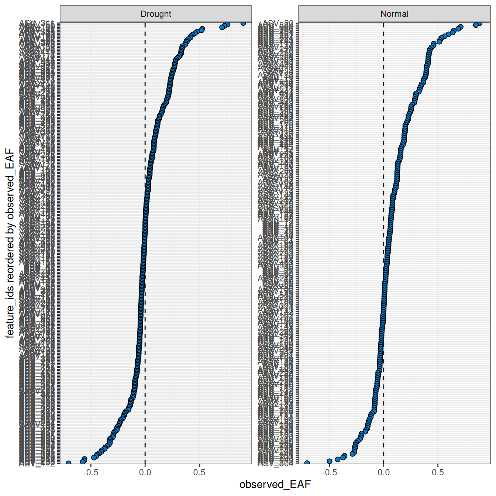
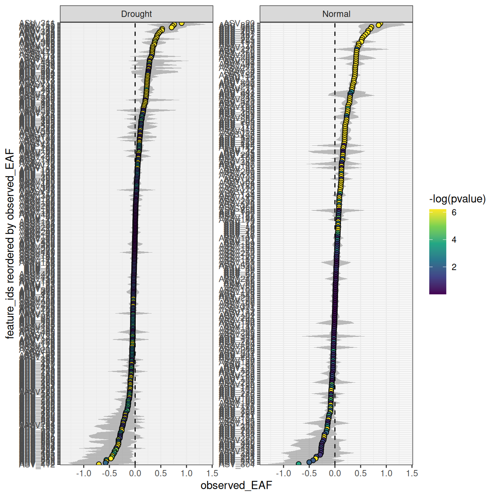
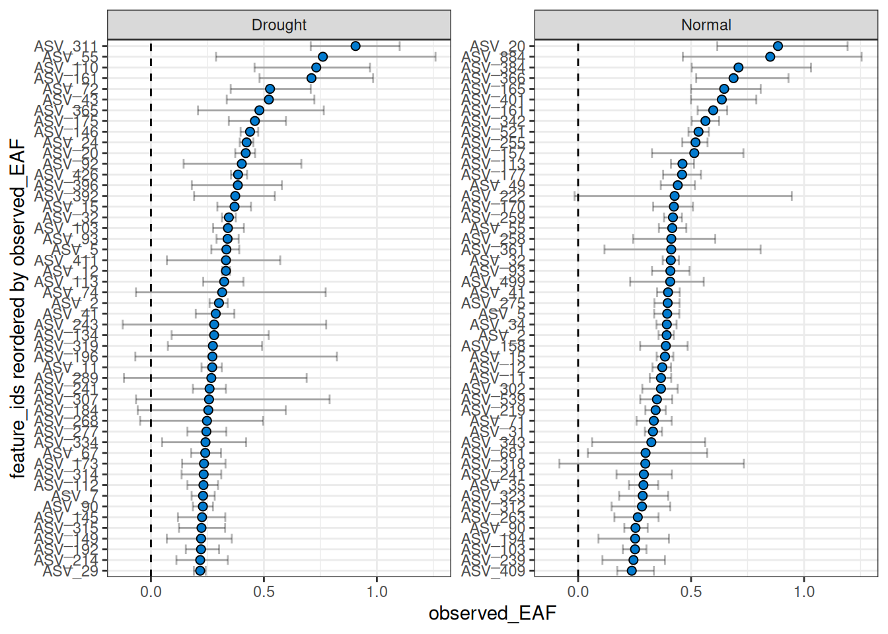
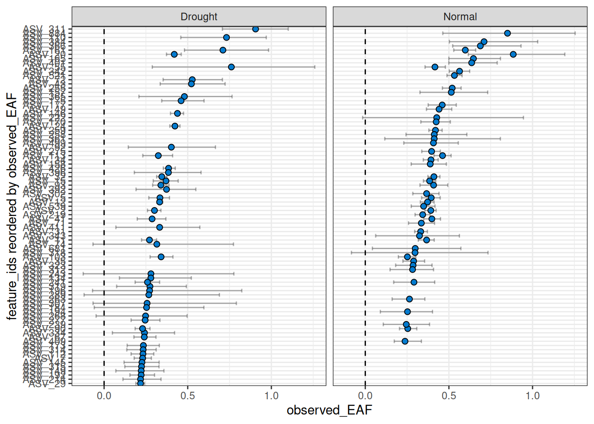
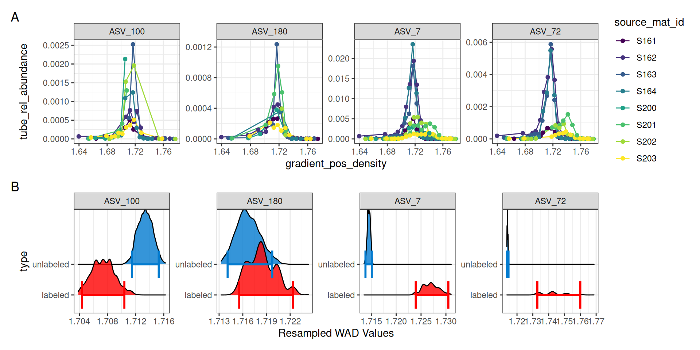
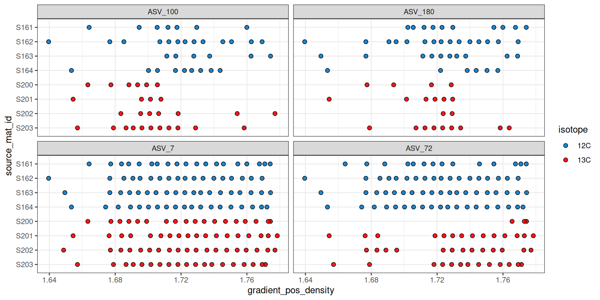
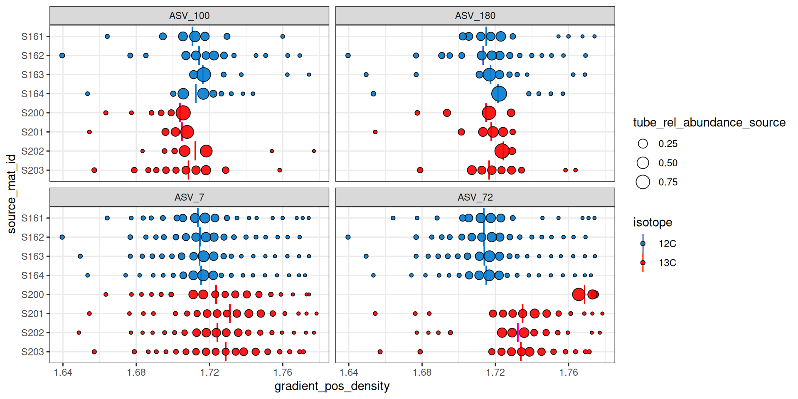

# EAF Calculations

``` r
library(dplyr)
library(ggplot2)
library(patchwork)
library(qSIP2)
packageVersion("qSIP2")
#> [1] '0.23.8'
```

## Background

### What is EAF?

The excess atom fraction (EAF) quantifies isotope incorporation at the
level of individual features (e.g. ASVs, MAGs). It represents the
proportion of a feature’s biomass that was synthesized from the labeled
substrate during the incubation period. EAF values are calculated from
the shift in weighted average density (WAD) between unlabeled and
labeled samples, following the equations in Hungate et
al. 2015[¹](#fn1).

EAF values range from 0 to 1, where 0 indicates no incorporation of the
label and 1 indicates that all biomass was derived from the labeled
substrate. Negative EAF values are mathematically possible and typically
indicate that a feature is slightly denser in the unlabeled treatment
than the labeled — usually a result of natural variation rather than
true incorporation.

### How EAF is calculated

[`run_EAF_calculations()`](https://jeffkimbrel.github.io/qSIP2/reference/run_EAF_calculations.md)
applies the Hungate et al. equations to each bootstrap resample
independently, producing a distribution of EAF estimates per feature.
[`summarize_EAF_values()`](https://jeffkimbrel.github.io/qSIP2/reference/summarize_EAF_values.md)
then collapses that distribution into a mean and confidence interval.
This resampling-based approach is what allows `qSIP2` to propagate
uncertainty from the WAD estimates through to the final EAF values.

### Working with multiple comparisons

This vignette uses a list of `qsip_data` objects representing different
experimental comparisons (e.g. “Normal” vs. “Drought” moisture
treatments). The list-based workflow is covered in the [multiple objects
vignette](https://jeffkimbrel.github.io/qSIP2/articles/multiple_objects.md)
— here we focus on the EAF calculations and how to interpret and
visualize the results.

## Getting EAF values

The following code builds two comparisons — “Normal” and “Drought” —
using
[`run_comparison_groups()`](https://jeffkimbrel.github.io/qSIP2/reference/run_comparison_groups.md),
which internally calls
[`run_EAF_calculations()`](https://jeffkimbrel.github.io/qSIP2/reference/run_EAF_calculations.md)
on each.

``` r
qsip_list = get_comparison_groups(example_qsip_object, group = "Moisture") |> 
  select("group" = Moisture, "unlabeled" = "12C", "labeled" = "13C") |>
  run_comparison_groups(example_qsip_object, 
                        seed = 99,
                        allow_failures = TRUE)
#> Finished groups ■■■■■■■■■■■■■■■■                  50%
#> Finished groups ■■■■■■■■■■■■■■■■■■■■■■■■■■■■■■■  100%
#> 
```

### Plotting

Plotting the results shows a wide range of EAF values between the two
comparisons ([Figure 1](#fig-eaf-default)).

``` r
plot_EAF_values(qsip_list)
#> ℹ Confidence level = 0.9
```



Figure 1: EAF values for the Normal and Drought comparisons using
default settings (90% confidence interval).

The `color_by` argument controls how features are colored. By default
features are colored blue, but `color_by = "pval"` colors by
significance and `color_by = "success"` colors by whether features meet
the threshold set by the `success_ratio` parameter — which is only
meaningful if `allow_failures = TRUE` was set during resampling. The
`confidence` and `error` arguments control the interval style.

``` r
plot_EAF_values(qsip_list,
                confidence = 0.95,
                error = "ribbon",
                color_by = "pval")
#> ℹ Confidence level = 0.95
```



Figure 2: EAF values colored by p-value significance, compared to the
default blue coloring in [Figure 1](#fig-eaf-default). A 95% confidence
interval is shown as a ribbon.

The number of features can be filtered to include the *n* with the
highest EAF.

``` r
plot_EAF_values(qsip_list,
                top = 50,
                error = "bar")
#> ℹ Confidence level = 0.9
```



Figure 3: Top 50 features by EAF value with 90% confidence intervals
shown as error bars.

By default, the facets do not share the same y-axis so each comparison
is sorted from high to low independently. But, if you want to compare
the EAF values between the two comparisons, you can set
`shared_y = TRUE`. Keep in mind that the top *n* is calculated for each,
so you may end up with more than *n* features in the plot if there isn’t
much overlap between the two comparisons.

``` r
plot_EAF_values(qsip_list,
                top = 50,
                shared_y = TRUE,
                error = "bar")
#> Warning: When `shared_y` is "TRUE" and `top` is set, data may be missing from plots if a
#> feature ranks in the top 50 of one comparison but not another.
#> ℹ Confidence level = 0.9
```



Figure 4: Top 50 features with a shared y-axis across both comparisons.

> **Warning:** As seen in the warning above, a current limitation when
> using `shared_y = TRUE` together with the `top` argument is that only
> the top *n* will be shown per facet, giving a blank value for any
> features that are not in the top *n* for that comparison. This does
> not mean they lack EAF values or were not found. This limitation may
> be addressed in the future.

### Returning results as a data frame

You can also return the results as a dataframe using
[`summarize_EAF_values()`](https://jeffkimbrel.github.io/qSIP2/reference/summarize_EAF_values.md)
and a desired confidence (default is 90%).

``` r
summarize_EAF_values(qsip_list)
```

    #> ℹ Confidence level = 0.9

| group   | feature_id | observed_EAF | mean_resampled_EAF |      lower |      upper |  pval | labeled_resamples | unlabeled_resamples | labeled_sources | unlabeled_sources |
|:--------|:-----------|-------------:|-------------------:|-----------:|-----------:|------:|------------------:|--------------------:|----------------:|------------------:|
| Drought | ASV_1      |   -0.0491540 |         -0.0483554 | -0.1082032 |  0.0087336 | 0.178 |              1000 |                1000 |               4 |                 4 |
| Normal  | ASV_1      |    0.0004555 |          0.0000135 | -0.0325729 |  0.0356580 | 0.986 |              1000 |                1000 |               3 |                 4 |
| Drought | ASV_10     |    0.0547586 |          0.0550897 |  0.0344674 |  0.0747572 | 0.000 |              1000 |                1000 |               4 |                 4 |
| Normal  | ASV_10     |    0.1121811 |          0.1116458 |  0.0713690 |  0.1506676 | 0.000 |              1000 |                1000 |               3 |                 4 |
| Drought | ASV_100    |   -0.1116096 |         -0.1110421 | -0.1681262 | -0.0503753 | 0.000 |              1000 |                1000 |               4 |                 4 |
| Normal  | ASV_100    |    0.0090370 |          0.0088377 | -0.0523892 |  0.0703022 | 0.798 |              1000 |                1000 |               3 |                 4 |

Table 1: The first few rows of EAF results across all comparisons.

## Exploring individual features

EAF values alone don’t always tell the full story. A feature might have
a surprisingly high or negative EAF, and understanding why requires
looking at the underlying data — how the density curves are shaped,
whether the resampling distributions overlap, and how consistently the
feature appears across fractions. `qSIP2` provides several functions for
this kind of exploration, and it’s worth using them to QC results before
drawing conclusions.

As an example, we will pick 4 features spanning the range of EAF values
in the “Drought” comparison — one each with high, medium, low, and
negative EAF values — and use
[`summarize_EAF_values()`](https://jeffkimbrel.github.io/qSIP2/reference/summarize_EAF_values.md),
[`plot_feature_curves()`](https://jeffkimbrel.github.io/qSIP2/reference/plot_feature_curves.md),
[`plot_feature_resamplings()`](https://jeffkimbrel.github.io/qSIP2/reference/plot_feature_resamplings.md),
and
[`plot_feature_occurrence()`](https://jeffkimbrel.github.io/qSIP2/reference/plot_feature_occurrence.md)
to understand what’s driving each result.

``` r
features = c("ASV_72", "ASV_7", "ASV_180", "ASV_100")

summarize_EAF_values(qsip_list$Drought) |>
  filter(feature_id %in% features)
```

    #> ℹ Confidence level = 0.9

| feature_id | observed_EAF | mean_resampled_EAF |      lower |      upper |  pval | labeled_resamples | unlabeled_resamples | labeled_sources | unlabeled_sources |
|:-----------|-------------:|-------------------:|-----------:|-----------:|------:|------------------:|--------------------:|----------------:|------------------:|
| ASV_72     |    0.5271129 |          0.5246305 |  0.3529541 |  0.7072885 | 0.000 |              1000 |                1000 |               4 |                 4 |
| ASV_7      |    0.2305506 |          0.2307068 |  0.1799998 |  0.2823904 | 0.000 |              1000 |                1000 |               4 |                 4 |
| ASV_180    |    0.0308346 |          0.0318743 | -0.0425104 |  0.0994295 | 0.448 |              1000 |                1000 |               4 |                 4 |
| ASV_100    |   -0.1116096 |         -0.1110421 | -0.1681262 | -0.0503753 | 0.000 |              1000 |                1000 |               4 |                 4 |

Table 2: EAF results for 4 chosen features from the Drought comparison,
ordered by decreasing mean EAF.

Using a combination of
[`plot_feature_curves()`](https://jeffkimbrel.github.io/qSIP2/reference/plot_feature_curves.md)
and
[`plot_feature_resamplings()`](https://jeffkimbrel.github.io/qSIP2/reference/plot_feature_resamplings.md)
we can plot these 4 features (with some help from the `patchwork`
library).

``` r
a = plot_feature_curves(qsip_list$Drought, features) + facet_wrap(~feature_id, nrow = 1, scales = "free")
b = plot_feature_resamplings(qsip_list$Drought, features, intervals = "bar", confidence = 0.95) + facet_wrap(~feature_id, nrow = 1, scales = "free")
(a / b) +
  plot_layout(axes = "collect") +
  plot_annotation(tag_levels = 'A')
```



Figure 5: Density curves (A) and resampling distributions (B) for four
example features from the Drought comparison.

For ASV_7 and ASV_72, it is clear in panel A of
[Figure 5](#fig-feature-curves) that the ¹³C labeled isotope has a nice
shift compared to the unlabeled ¹²C sources. Indeed, the resampling
results summarized in panel B also show a clear distinction with
non-overlapping confidence intervals. ASV_180, which had an EAF value
close to zero shows a much smaller density shift between the unlabeled
and labeled samples, and the resampling results show overlapping
confidence intervals.

ASV_100, on the other hand, shows a negative EAF value. In panel A we
can see the peaks of the ¹³C do appear shifted left of the ¹²C, and
although the confidence intervals do not overlap, we don’t expect to see
lower ¹³C density values compared to ¹²C. In panel A, it appears two of
the ¹³C lines abruptly end, which may be a sign that ASV_100 doesn’t
occur in as many fractions as necessary.

The
[`plot_feature_occurrence()`](https://jeffkimbrel.github.io/qSIP2/reference/plot_feature_occurrence.md)
function can be used to see how often a feature occurs in the samples
and give some idea about whether they span the range of densities, are
found in fractions close or far from one another, and how the calculated
WAD value is affected by these occurrences.

``` r
plot_feature_occurrence(qsip_list$Drought, features)
```



Figure 6: Feature occurrence across density fractions for the four
example features from the Drought comparison.

[Figure 6](#fig-feature-occurrence) shows that ASV_100 stops appearing
in some labeled sources after a density of ~1.7. With `show_wad = TRUE`
and `scale = "feature"` we can overlay the WAD values and relative
abundance ([Figure 7](#fig-feature-occurrence-wad)). Here, the size of
the circle represents the relative abundance of the feature in the
sample, and for ASV_100 we see the most abundant fraction does heavily
influence the calculated WAD value (vertical bar). So, although missing
data on the “right side” of the curve may lead to issues, it doesn’t
seem to affect the WAD value for ASV_100, assuming the peak of the
values are in that most abundant fraction.

``` r
plot_feature_occurrence(qsip_list$Drought,
                        features,
                        show_wad = TRUE,
                        scale = "feature")
```



Figure 7: Feature occurrence with WAD values (vertical bar) and relative
abundance (circle size) overlaid.

[Figure 7](#fig-feature-occurrence-wad) can also help identify
additional potential issues. For example, ASV_72 was one of the features
with the highest EAF values, but it looks like source S200 only has it
in the extremely heavy fractions, and it has a calculated WAD that is
much higher than the other ¹³C sources. When we ran
[`run_comparison_groups()`](https://jeffkimbrel.github.io/qSIP2/reference/run_comparison_groups.md)
at the very beginning we didn’t define a minimum number of fractions, so
the default of 2 was used. We might, however, consider increasing the
minimum number of labeled fractions required to remove sources with
feature occurrences like ASV_72 in source S200.

## Conclusion

EAF values quantify isotope incorporation at the feature level, and the
exploration tools shown here — density curves, resampling distributions,
and occurrence plots — are valuable for understanding what drives any
given result before drawing biological conclusions. The next step in the
workflow is [delta
EAF](https://jeffkimbrel.github.io/qSIP2/articles/delta_EAF.md), which
extends this framework to compare EAF values between experimental
groups.

------------------------------------------------------------------------

1.  Hungate et al. 2015, *Applied and Environmental Microbiology*.
    <https://journals.asm.org/doi/10.1128/aem.02280-15>
