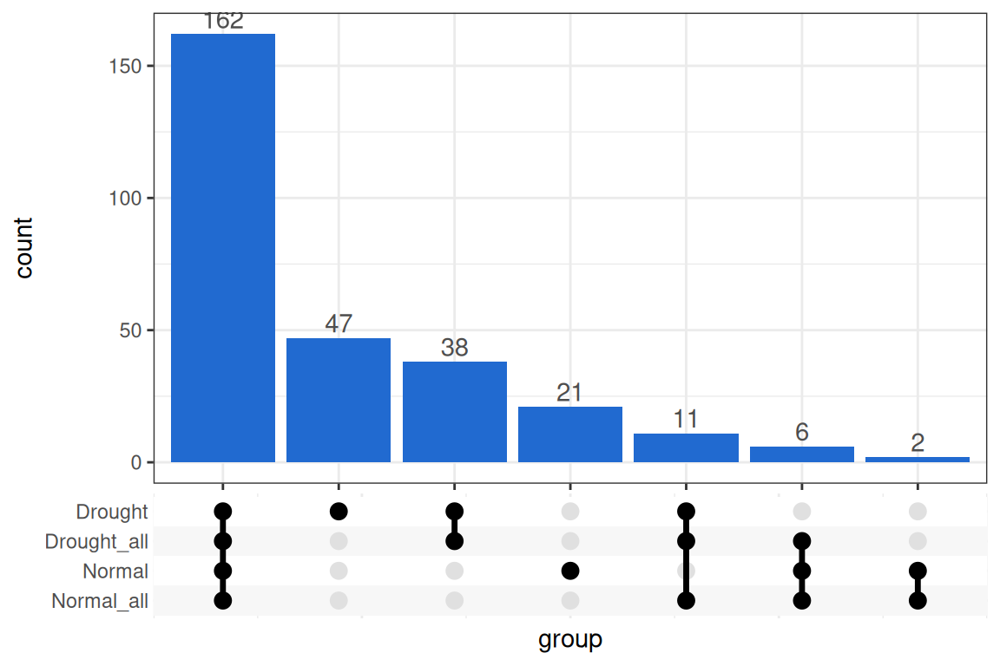
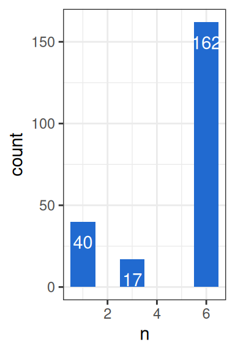
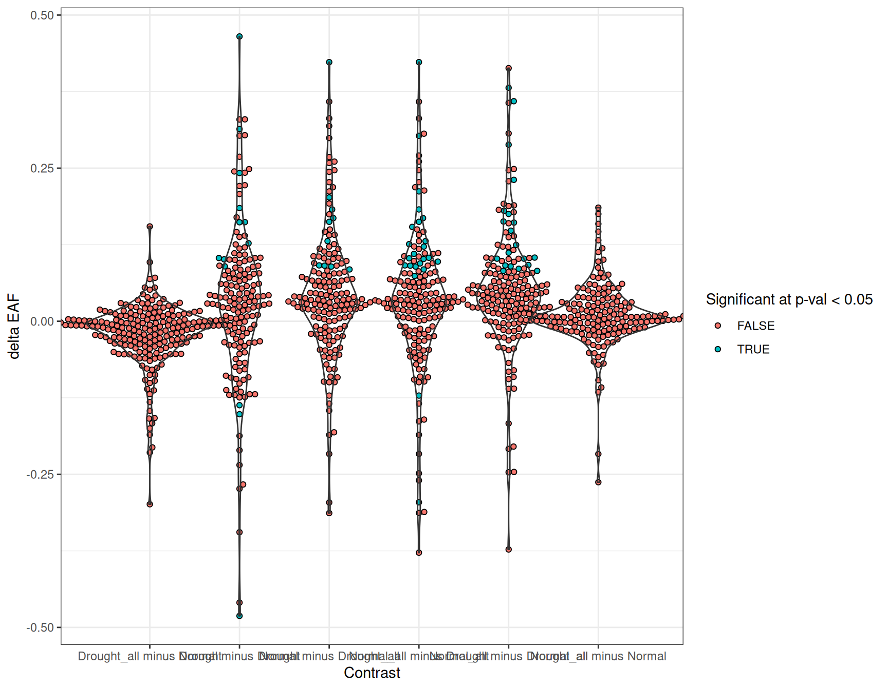
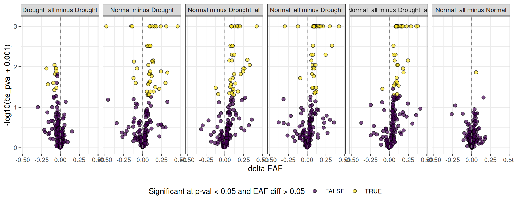
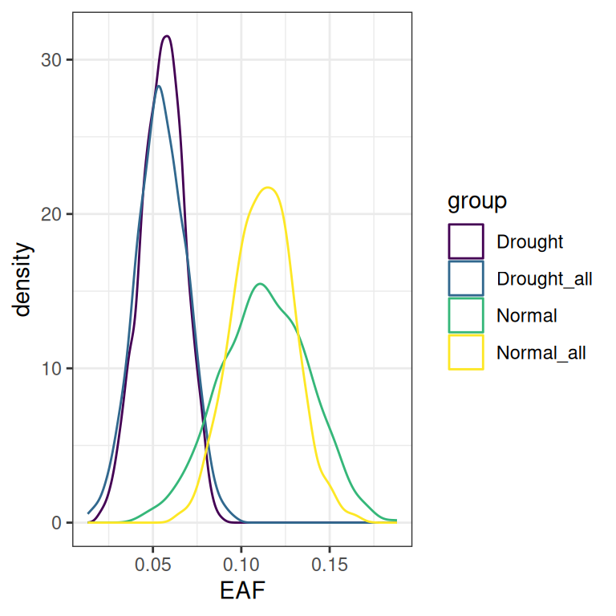
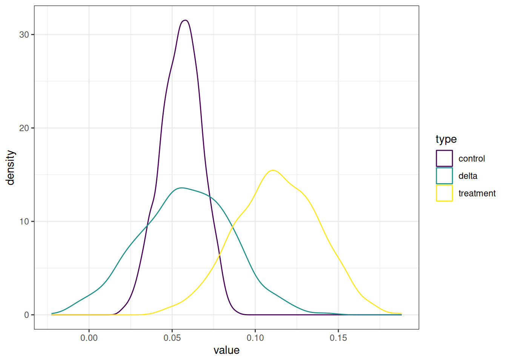

# Delta EAF Workflow

``` r
library(dplyr)
library(ggplot2)
library(ggupset)
library(tidyr)
library(tibble)
library(qSIP2)
packageVersion("qSIP2")
#> [1] '0.23.5'
```

## Background

This is a demo of the delta EAF method introduced in `qSIP2 v0.22`. The
idea behind delta EAF is to answer the question “does my feature have a
different level of incorporation in this treatment vs that treatment?”
The tricky part about this calculation using raw EAF values is that you
only get one per treatment - all replicates and any original idea of
obtaining sample variance goes out the window, and you’re left asking
“is 4.3% different than 8.1%?”, which is a difficult question.

We did, however, at one point have replicates… and what about those
bootstraps?

So, let’s dive in to this delta EAF calculation and see if and how it
overcomes the initial limitations.

Note, through `qSIP2` the term “comparisons” is meant to imply the
original idea of which labeled sources do you want to *compare* with
which unlabeled sources. For delta EAF, the term *contrast* is used to
say which comparison is *contrasted* with another comparison. Hopefully
this terminology doesn’t trip anyone up or lead to confusion. Not
helping things, the idea of a *group* is really referring to a
comparison.

### Build qSIP2 list

The delta EAF function require a `qSIP2` list, so we will make that
here. Like any other qSIP2 list object, each *group* will give an EAF
value for any features that pass that groups independent filtering
steps. This means you can use the list to compare between experimental
treatments, but also see how different filtering parameters or other
decision affect the outcome. Here, we will make an object for drought
and normal treatments using the built in object compared just to their
12C sample pairs, or against *all* 12C samples, giving us 4 total
groups.

``` r
q <- tribble(
  ~group,        ~unlabeled,               ~labeled,                 ~min_unlabeled_sources,
  "Normal",      "S149, S150, S151, S152", "S178, S179, S180",       3,
  "Drought",     "S161, S162, S163, S164", "S200, S201, S202, S203", 3,
  "Normal_all",  "12C",                    "S178, S179, S180",       6,
  "Drought_all", "12C",                    "S200, S201, S202, S203", 6
) |>
  run_comparison_groups(example_qsip_object,
    allow_failures = T,
    seed = 41
  )
#> Finished groups ■■■■■■■■■                         25%
#> Finished groups ■■■■■■■■■■■■■■■■                  50%
#> Finished groups ■■■■■■■■■■■■■■■■■■■■■■■           75%
#> Finished groups ■■■■■■■■■■■■■■■■■■■■■■■■■■■■■■■  100%
#> 
```

Importantly, the idea of a “Delta EAF” implies we are looking to
quantify the differences between treatments, and so therefore for a
certain feature it must have an EAF value in both of those treatments.
Since each original EAF calculation is done on a different set of source
material, a feature may pass the filtering in one comparison, but not
the other. In [Table 1](#tbl-overlaps) we run a check to count just how
many features are even comparable between all treatments.

``` r
overlaps = get_overlap_sizes(q)
```

| group1      | group2      | overlapping_features |
|:------------|:------------|---------------------:|
| Drought     | Drought_all |                  211 |
| Drought     | Normal      |                  162 |
| Drought     | Normal_all  |                  173 |
| Drought_all | Normal      |                  168 |
| Drought_all | Normal_all  |                  179 |
| Normal      | Normal_all  |                  170 |

Table 1

Although not yet a stand alone `qSIP2` function, we can make an upset
plot showing a similar idea ([Figure 1](#fig-upset_plot)).

``` r
lapply(q, get_EAF_data) |>
  bind_rows(.id = "group") |> 
  filter(is.na(resample)) |>
  select(group, feature_id) |>
  summarize(group = list(group), .by = feature_id) |>
  ggplot(aes(x = group)) +  
    geom_bar() +  
    ggupset::scale_x_upset() +
    geom_bar(fill = "#216AD0") +  
    geom_text(stat='count', aes(label=after_stat(count)), vjust=-0.3, color = "gray30")
```



Figure 1: Filtered feature_ids shared between groups

Again, these are just some checks to see which feature_ids it is even
possible to get a delta EAF for.

## Delta EAF

### Identify the contrasts

To run the delta EAF calculations, you must first define your
*contrasts*. If you don’t define the contrasts up front the function
will do an *all-by-all* comparison, but this may not be ideal because 1)
not all contrasts are meaningful, and 2) you can’t determine which is
the *treatment* and which is the *control*. We’ll go over the details of
the delta EAF function below, but at a high level the *delta* of delta
EAF is looking at the differences in some distribution of EAF values
between the treatment and the control. This delta is \\treatment -
control\\, and so positive values indicate a higher EAF in the the
treatment, and negative values indicate a higher EAF in the control. In
your contrasts, knowing which is the treatment and which is the control
is critical for interpretation.

The
[`make_delta_EAF_contrasts()`](https://jeffkimbrel.github.io/qSIP2/reference/make_delta_EAF_contrasts.md)
will make a tibble of contrasts for you from your qSIP2 list object,
again in an *all-by-all* format and with treatment/control pairings that
may or may not be what you want ([Table 2](#tbl-default_contrasts)).

``` r
contrasts = make_delta_EAF_contrasts(q)
```

| control     | treatment   | contrast                  |
|:------------|:------------|:--------------------------|
| Drought     | Drought_all | Drought vs Drought_all    |
| Drought     | Normal      | Drought vs Normal         |
| Drought     | Normal_all  | Drought vs Normal_all     |
| Drought_all | Normal      | Drought_all vs Normal     |
| Drought_all | Normal_all  | Drought_all vs Normal_all |
| Normal      | Normal_all  | Normal vs Normal_all      |

Table 2: The default contrasts are just best guesses and may not be
relevant control/treatment combinations, or may not accurately pick
which is the control

For example, it is interesting to compare the drought to normal, and
maybe each of those treatments against their “\_all” counterpart… but
perhaps the “Drought vs Normal_all” and “Drought_all vs Normal”
contrasts aren’t that useful. Additionally, you may not like the default
contrast names which goes under the format of *control vs treatment*. To
fix both of these issues, you can do an inline
[`filter()`](https://dplyr.tidyverse.org/reference/filter.html) and
[`mutate()`](https://dplyr.tidyverse.org/reference/mutate.html) to get
the contrasts exactly how you want it
([Table 3](#tbl-better_contrasts)).

``` r
contrasts = make_delta_EAF_contrasts(q) |>
  dplyr::filter(!contrast %in% c("Drought vs Normal_all", "Drought_all vs Normal")) |>
  mutate(contrast = paste(treatment, control, sep = " minus "))
```

| control     | treatment   | contrast                     |
|:------------|:------------|:-----------------------------|
| Drought     | Drought_all | Drought_all minus Drought    |
| Drought     | Normal      | Normal minus Drought         |
| Drought_all | Normal_all  | Normal_all minus Drought_all |
| Normal      | Normal_all  | Normal_all minus Normal      |

Table 3: The contrasts table can be modified to make it more useful, or
you can create one from scratch using tribble or an excel file.

### Run delta EAF contrasts

The
[`run_delta_EAF_contrasts()`](https://jeffkimbrel.github.io/qSIP2/reference/run_delta_EAF_contrasts.md)
function takes our qSIP2 list object (and optional contrasts) and
generates a tibble with a line of output for each feature_id in each
contrast. Since we already have a contrasts file, we can provide it. If
we left it empty, then it would generate the same contrasts as the base
[`make_delta_EAF_contrasts()`](https://jeffkimbrel.github.io/qSIP2/reference/make_delta_EAF_contrasts.md)
function. We also give it the confidence level of 95%.

``` r
delta_EAF = run_delta_EAF_contrasts(q, 
                                    contrasts = contrasts,
                                    confidence = 0.95) 
#> ℹ Confidence level = 0.95
#> step 1/2: calculating deltas... ■■■■■■■■■■■■■■■■■■■■■■■■          76% |  ETA:  …
#> step 2/2: summarizing delta statistics ■■■■■■■■■■■■                      38% | …
#> ! there were 74 contrast and 127 bs_pval result messages
```

Here, we get a warning that there were “74 contrast” and “66 `bs_pval`”
warnings. I’ll explain the contrast warnings now, but save the second
message explanation for later down. Simply put, the first warning is
telling us that 74 feature_ids weren’t able to have a delta EAF
calculated for all contrasts because it was filtered out of either or
both of the groupings used for that contrast. So, normally there would
be 4 rows per feature_id (because our contrasts table had 4 contrasts),
but some feature_ids will have less. Looking at a histogram of features
and their contrast count ([Figure 2](#fig-contrast_warnings)) we see
that 162 are indeed found in all 4 contrasts, but 40 are found in only
one contrast, and 17 are found in only 2.



Figure 2

That “17” gets counted twice for `17+17+40 = 74` to get us to count in
the warning. For now, in each *successful* contrast that message gets
printed. For example, `ASV_167` had two successful contrasts, and two
failed… so the same message was printed in both successful contrasts
listing the failed contrasts. This is intentional friction to make it
clear when you are looking at either of these rows - only some of the
contrasts were successful.

| feature_id | contrast_message                                                             |
|:-----------|:-----------------------------------------------------------------------------|
| ASV_167    | skipped 2 missing contrast(s): Normal minus Drought, Normal_all minus Normal |
| ASV_167    | skipped 2 missing contrast(s): Normal minus Drought, Normal_all minus Normal |

Note, you’ll only get a warning for features that are valid in at least
one contrast. For example, if there is a feature present only in the
“drought_all” group, it won’t be valid in any of the contrasts and
therefore won’t be present in the output table nor generate a warning.

## Inspecting results

Our results are stored in the `delta_EAF` dataframe. We can pick an
example feature_id to look at, so let’s pick `ASV_10` because it was
“significant” in some contrasts, but not others.

### ASV_10

``` r
ASV_10 = delta_EAF |>
  filter(feature_id == "ASV_10")
```

| feature_id | contrast                     |      delta |      lower |     upper |        sd | bs_pval | bs_pval_message |      pval | contrast_message |
|:-----------|:-----------------------------|-----------:|-----------:|----------:|----------:|--------:|:----------------|----------:|:-----------------|
| ASV_10     | Drought_all minus Drought    | -0.0004450 | -0.0265342 | 0.0265701 | 0.0139587 |   0.940 | NA              | 0.9745663 | NA               |
| ASV_10     | Normal minus Drought         |  0.0574224 |  0.0025274 | 0.1122189 | 0.0277423 |   0.040 | NA              | 0.0384665 | NA               |
| ASV_10     | Normal_all minus Drought_all |  0.0583124 |  0.0144726 | 0.1051709 | 0.0226059 |   0.004 | NA              | 0.0098938 | NA               |
| ASV_10     | Normal_all minus Normal      |  0.0004449 | -0.0438587 | 0.0455810 | 0.0231538 |   0.956 | NA              | 0.9846679 | NA               |

Table 4

Two of the 4 `bs_pval` p-values (explained below) are “significant”, and
two are not. Interestingly, the non-significant values come from
contrasts comparing the “in-treatment” unlabeled sources vs. using
“all-treatment” unlabeled. So, although they did give different EAF
values, they were not deemed significantly different via the delta EAF
method.

The two significant differences were between both types of Drought vs
Normal, with Normal having a higher EAF than Drought, for this feature.
I’ll explain how the `bs_pval` value gets calculated later, but briefly
the null hypothesis is whether the true delta EAF value is approximately
zero, and there is evidence for these two contrasts that it is not zero.

### A more global look

We can plot the `delta` values for each contrast together. In
[Figure 3](#fig-violin) it is clear that the widest part of the plots
for each is near zero, indicating many of the features don’t have a
strong different in their EAF values. But in some cases there are clear
global shifts, for example normal_all seems to have more overall
enrichment than drought_all.



Figure 3

#### Volcano plots

One way to show this data that fits intuitively with transcriptomics
results is the volcano plot. Similar to transcriptomes, the x-axis
displays the difference in EAF values (as opposed to expression
differences) with point to the right of the line being higher in the
control, and to the left of the line being higher in the treatment. The
y-axis displays the “significance”, here as the negative log10 of
`bs_pval`.

``` r
sig_pval = 0.05
eaf_diff = 0.05

delta_EAF |>
  mutate(sig = case_when(
    abs(delta) >= eaf_diff & bs_pval < sig_pval ~ TRUE,
    .default = FALSE
  )) |>
    ggplot(aes(x = delta, y = -log10(bs_pval+0.001))) +
      geom_point(aes(fill = sig), pch = 21, size = 2, alpha = 0.7) +
      facet_wrap(~contrast, nrow = 1) +
      expand_limits(y = 3.1) +
      theme(legend.position = "bottom") +
      scale_fill_viridis_d() +
      geom_vline(xintercept = 0, linetype = "dashed", color = "gray50") +
      labs(x = "delta EAF",
           fill = glue::glue("Significant at p-val < {sig_pval} and EAF diff > {eaf_diff}"))
```



Figure 4

### bs_pval error message

The delta EAF workflow produces a dataframe with two columns that
collect error/warning messages. The `contrast_message` was explained
previously, and here the `bs_pval_message` is explained.

Because calculating delta requires pairing the EAF values based on their
resample number, this can fail in two cases.

The first is simply if the two groups did a different number of
resamples, say 1000 in group A and 500 in group B, then obviously we can
only pair up resamples 1-500 and have to skip 501-1000 for group A.

The second case is when we use `allow_failures = TRUE` during the
resampling step (see the [resampling
vignette](https://jeffkimbrel.github.io/qSIP2/articles/resampling.md)).
Here, although there may be 1000 resamples in both groups, there may be
sporadic `NA` values filled in when the resampling failed.

| feature_id | contrast                  |   bs_pval | bs_pval_message                                       |
|:-----------|:--------------------------|----------:|:------------------------------------------------------|
| ASV_34     | Normal minus Drought      | 0.0129450 | Removed 691 NA bootstrap replicate(s) of 1000 (69.1%) |
| ASV_117    | Drought_all minus Drought | 0.6761364 | Removed 648 NA bootstrap replicate(s) of 1000 (64.8%) |
| ASV_55     | Normal minus Drought      | 0.2392027 | Removed 699 NA bootstrap replicate(s) of 1000 (69.9%) |

Table 5: Three random instances of a bs_pval_message warning

The warning in the `bs_pval` column is just telling us how many of the
resamples were skipped because a delta couldn’t be calculated.

## The delta EAF calculations

Under the hood, the delta EAF calculations use the same resampled EAF
values already used to calculate both the EAF and the EAF confidence
intervals reported in
[`summarize_EAF_values()`](https://jeffkimbrel.github.io/qSIP2/reference/summarize_EAF_values.md).
During these calculations, within an original `qSIP2` object each
feature will have a collection of 1,000 resampled EAF values, together
making up a distribution of resampled EAF values. This data can be
accessed via the
[`get_EAF_data()`](https://jeffkimbrel.github.io/qSIP2/reference/get_EAF_data.md)
function. The `resample` column contains the number of that specific
resampling, and the “real” data is also stored here with a `resample`
value of `NA`… so we can remove that. Below, we get the 1000 resamples
of our example `ASV_10` in different groups (comparisons).

### Resampled EAF distributions

``` r
ASV_10_EAF = get_EAF_data(q) |>
  filter(feature_id == "ASV_10") |>
  filter(!is.na(resample))
```

| group       | feature_id | resample | W_lab_mean | W_unlab_mean | observed |         Z |         G |        M | atom_count | M_labeledmax | M_labeled |       EAF |
|:------------|:-----------|:---------|-----------:|-------------:|:---------|----------:|----------:|---------:|-----------:|-------------:|----------:|----------:|
| Drought     | ASV_10     | 1        |   1.715289 |     1.711749 | FALSE    | 0.0035398 | 0.7866661 | 308.0812 |   9.606667 |     317.6634 |  308.7183 | 0.0657490 |
| Drought_all | ASV_10     | 1        |   1.715289 |     1.713751 | FALSE    | 0.0015377 | 0.8106425 | 308.0931 |   9.594679 |     317.6634 |  308.3695 | 0.0285640 |
| Normal      | ASV_10     | 1        |   1.718697 |     1.712044 | FALSE    | 0.0066530 | 0.7902033 | 308.0829 |   9.604898 |     317.6634 |  309.2802 | 0.1235757 |
| Normal_all  | ASV_10     | 1        |   1.718697 |     1.712218 | FALSE    | 0.0064790 | 0.7922873 | 308.0840 |   9.603856 |     317.6634 |  309.2498 | 0.1203445 |
| Drought     | ASV_10     | 10       |   1.715232 |     1.712508 | FALSE    | 0.0027240 | 0.7957565 | 308.0857 |   9.602122 |     317.6634 |  308.5757 | 0.0505972 |
| Drought_all | ASV_10     | 10       |   1.715232 |     1.711489 | FALSE    | 0.0037433 | 0.7835503 | 308.0796 |   9.608225 |     317.6634 |  308.7535 | 0.0695262 |
| Normal      | ASV_10     | 10       |   1.718697 |     1.711796 | FALSE    | 0.0069010 | 0.7872345 | 308.0815 |   9.606383 |     317.6634 |  309.3235 | 0.1281786 |
| Normal_all  | ASV_10     | 10       |   1.718697 |     1.713259 | FALSE    | 0.0054378 | 0.8047561 | 308.0902 |   9.597622 |     317.6634 |  309.0680 | 0.1010105 |

Table 6: The first few lines of ASV_10_EAF, ordered by resample number

Plotting those values on a density plot shows the overall shape of the 4
distributions. Remember, each feature_id will have it’s own shapes.



Figure 5: Distribution of 1000 resampled EAF values for feature ASV_10.

### Delta distributions

The first step in calculating the singular *delta* value is getting the
resampled delta values for each contrast. This is a pairwise comparison
of resample 1 in both groups, then resample 2, etc, until all we have a
distribution of delta EAF values the same length as the smallest
distribution of that contrast. Again, delta is calculated as
`treatment - control`.

| contrast             | resample | treatment |   control |     delta |
|:---------------------|:---------|----------:|----------:|----------:|
| Normal minus Drought | 1        | 0.1235757 | 0.0657490 | 0.0578267 |
| Normal minus Drought | 2        | 0.1439361 | 0.0311198 | 0.1128163 |
| Normal minus Drought | 3        | 0.1069522 | 0.0637726 | 0.0431796 |
| Normal minus Drought | 4        | 0.0889793 | 0.0579187 | 0.0310606 |
| Normal minus Drought | 5        | 0.1104417 | 0.0550439 | 0.0553978 |
| Normal minus Drought | 6        | 0.1467758 | 0.0265535 | 0.1202223 |
| Normal minus Drought | 7        | 0.1399850 | 0.0548018 | 0.0851831 |
| Normal minus Drought | 8        | 0.0797960 | 0.0690198 | 0.0107762 |
| Normal minus Drought | 9        | 0.1438040 | 0.0594652 | 0.0843387 |
| Normal minus Drought | 10       | 0.1281786 | 0.0505972 | 0.0775814 |

Table 7: The first few rows of the delta calculations for ASV_10 for
just the “Normal minus Drought” contrast



Figure 6

In [Figure 6](#fig-ASV_10_results), the green line represents the delta
EAF distribution, which is the yellow line minus the purple line. This
delta distribution is still literally just the final EAF values from the
control group subtracted from the treatment group, but the confidence
intervals and `bs_pval` are derived from this distribution of delta
values. The 95% CI has the value for the 2.5% and 97.5% values in the
distribution.
