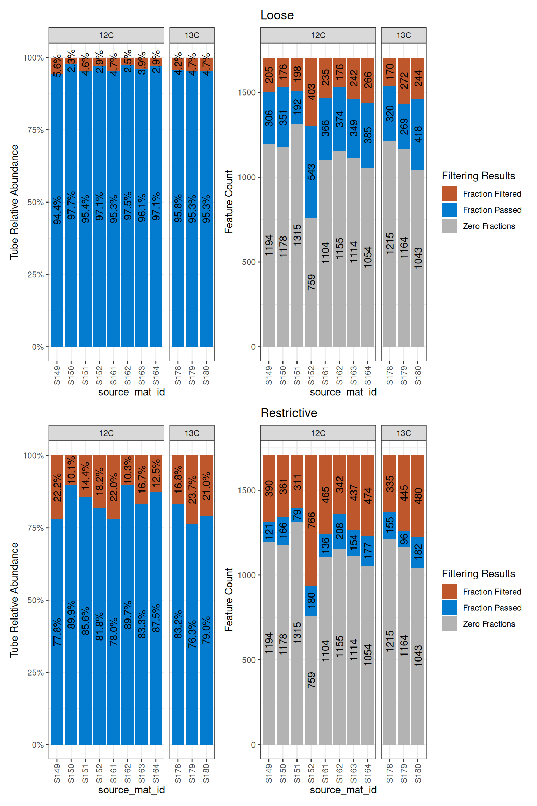

# Filtering Features

``` r
library(dplyr)
library(ggplot2)
library(patchwork)
library(stringr)
library(qSIP2)
packageVersion("qSIP2")
#> [1] '0.23.8'
```

## Background

After a qsip_data object is built and validated, the first step in the
analysis is to filter the features using
[`run_feature_filter()`](https://jeffkimbrel.github.io/qSIP2/reference/run_feature_filter.md).
This is done to narrow down the sources for a specific comparison, and
remove features that are not useful for the analysis.

## Filtering steps

Filtering has three sequential steps.

- identify relevant unlabeled and labeled `source_mat_id` values for a
  specific comparison
- score features considered as “present” in a source by using fraction
  count thresholds
- remove features that are not “present” in enough sources

Each step is detailed in the following sections.

### Step 1 - define the sources for a comparison

The first step in filtering is to identify the relevant source_mat_id
values for a specific comparison. The
[`run_feature_filter()`](https://jeffkimbrel.github.io/qSIP2/reference/run_feature_filter.md)
arguments most important for this step are `unlabeled_source_mat_ids`
and `labeled_source_mat_ids.` These are vectors of source_mat_id values
that are used to filter the features. These can be explicitly stated
(e.g. `unlabeled_source_mat_ids = c("source1", "source2")`), or they can
be identified by using some key terms that will identify all sources
satisfying that criteria (e.g. `get_all_by_isotope(qsip_object, "12C")`
or `get_all_by_isotope(qsip_object, "unlabeled")`).

There are internal validations for this step to make sure the sources
provided to a given argument make sense with the isotope designation in
the source data. For example, if you try to give a ¹³C source to the
`unlabeled_source_mat_ids` then there will be an error. If you try
sources with a mixture of heavy isotopes (e.g. ¹³C and ¹⁵N) to the
`labeled_source_mat_ids` then there will be an error. This can happen
either explicitly by providing the wrong source_mat_id values, or if you
have a mixture and choose “labeled” for `labeled_source_mat_ids`. Having
a mixture of unlabeled source isotopes (e.g. ¹²C and ¹⁴N), however, is
allowed and will not give an error.

The group argument is optional (but recommended) and provides a place
for a description of that particular comparison
(e.g. `group = "7 day drought treatment"`).

### Step 2 - score features as “present” in a source

(In this section, “fraction” and “sample” mean the same thing and are
used interchangeably)

Simplistically, a feature is considered present in a fraction/sample if
there are counts for it. Features present in only a few fractions,
however, can lead to inaccurate estimates of the weighted average
density (WAD) and should therefore be removed. For example, if a source
has 20 sequenced fractions (samples), each with their own read depths, a
feature appearing in only one sample may be because that sample happened
to have the deepest sequencing. Therefore, it wouldn’t be expected to be
an accurate representation of the true WAD values. Accordingly, a
feature should be present in at least a few fractions (let’s say 3) to
have a more trustworthy WAD value.

The minimum fraction count can be defined differently for the unlabeled
and labeled samples using the `min_unlabeled_fractions` and
`min_labeled_fractions` arguments, respectively. The function uses these
values to define a feature as “present” in a source if it is found in at
least that many samples (fractions).

### Step 3 - remove features that are not present in enough sources

The results of the last filtering step are used in this step to make a
final call for a `feature_id` in that comparison. If a feature is found
in at least the number of sources defined in `min_unlabeled_sources` and
`min_labeled_sources`, then it will survive the filtering step and move
on to resampling/EAF calculations.

> **Note:** When a `qsip_data` object is first created, tube relative
> abundances are calculated for all features together — this
> normalization step requires all features to be present at once. After
> that point, however, each feature’s WAD calculation and subsequent EAF
> values are computed entirely independently. Filtering out one feature
> has no effect on the results of any other. The filtered object carries
> the same WAD values as the original; filtering simply determines which
> features proceed to resampling and EAF calculations.

## Filtering example

As detailed in the [main
vignette](https://jeffkimbrel.github.io/qSIP2/articles/qSIP_workflow.md),
we can use the
[`get_comparison_groups()`](https://jeffkimbrel.github.io/qSIP2/reference/get_comparison_groups.md)
function to see the available comparisons (this is just a prediction
though!). We can run a few with the test dataset (`example_qsip_object`)
and see how the text result changes to allow less through as we get more
restrictive.

``` r
df = get_comparison_groups(example_qsip_object, 
                           group = "Moisture")
```

| Moisture | 12C                    | 13C                    |
|:---------|:-----------------------|:-----------------------|
| Normal   | S149, S150, S151, S152 | S178, S179, S180       |
| Drought  | S161, S162, S163, S164 | S200, S201, S202, S203 |

Table 1: get_comparison_groups() correctly identifies two comparisons

Example filtering using all unlabeled and only the “Normal” labeled
sources is shown below using two stringencies, “loose” and
“restrictive”.

``` r
loose <- run_feature_filter(example_qsip_object,
  unlabeled_source_mat_ids = get_all_by_isotope(example_qsip_object, "12C"),
  labeled_source_mat_ids = c("S178", "S179", "S180"),
  min_unlabeled_sources = 2,
  min_labeled_sources = 2,
  min_unlabeled_fractions = 2,
  min_labeled_fractions = 2,
  quiet = TRUE
)

restrictive <- run_feature_filter(example_qsip_object,
  unlabeled_source_mat_ids = get_all_by_isotope(example_qsip_object, "12C"),
  labeled_source_mat_ids = c("S178", "S179", "S180"),
  min_unlabeled_sources = 6,
  min_labeled_sources = 3,
  min_unlabeled_fractions = 6,
  min_labeled_fractions = 6,
  quiet = TRUE
)
```

Here, only 64 features pass the more restrictive criteria, but we get
257 by relaxing the criteria a little bit. By default,
[`run_feature_filter()`](https://jeffkimbrel.github.io/qSIP2/reference/run_feature_filter.md)
prints a verbose summary of each filtering step — use `quiet = TRUE` to
suppress this.

> **Note:** Relaxing the criteria too much can lead to errors later
> during resampling. An alternative approach is to set all `min_*`
> parameters to `1` (effectively no upfront filtering) and use
> `allow_failures = TRUE` in the resampling step to handle features that
> fail there instead. This can be a flexible way to let the data
> determine which features are usable, though the statistical
> implications of this approach have not been thoroughly evaluated. See
> the [resampling
> vignette](https://jeffkimbrel.github.io/qSIP2/articles/resampling.md)
> for more detail.

### Inspecting the filter results

A tabular view of the filtering results can be made with the
[`get_filter_results()`](https://jeffkimbrel.github.io/qSIP2/reference/get_filter_results.md)
function. The first column is the step of the filtering process. The
Zero Fractions/Sources and Source/Fraction Filtered rows can be
confusing/misleading because they may not be reflected in the actual
filtering results. This is because you may have features missing
entirely from one source, but if you are only requiring it to be found
in 3 out of 4 sources then it will survive the filtering. The
Fraction/Source Passed rows are more informative, and
[Table 2](#tbl-get_filter_results_loose) only shows these rows. The
numbers shown in the
[`run_feature_filter()`](https://jeffkimbrel.github.io/qSIP2/reference/run_feature_filter.md)
output include the union of “Fraction Passed”, and the intersection of
“Source Passed” is the final feature count after filtering.

| filter_step     | features_unlabeled | features_labeled | union | intersect | unlabeled_only | labeled_only |
|:----------------|-------------------:|-----------------:|------:|----------:|---------------:|-------------:|
| Fraction Passed |                780 |              497 |   870 |       407 |            373 |           90 |
| Source Passed   |                535 |              308 |   586 |       257 |            278 |           51 |

Table 2: Results of get_filter_results(loose), subsetting for some
columns and rows

| filter_step     | features_unlabeled | features_labeled | union | intersect | unlabeled_only | labeled_only |
|:----------------|-------------------:|-----------------:|------:|----------:|---------------:|-------------:|
| Fraction Passed |                299 |              209 |   346 |       162 |            137 |           47 |
| Source Passed   |                103 |               82 |   121 |        64 |             39 |           18 |

Table 3: Results of get_filter_results(restrictive), subsetting for some
columns and rows

By passing `type = "feature_ids"` to
[`get_filter_results()`](https://jeffkimbrel.github.io/qSIP2/reference/get_filter_results.md),
you can retrieve the actual feature IDs that passed or failed at each
step rather than counts — useful for identifying specific features to
investigate further.

After filtering,
[`get_object_summary()`](https://jeffkimbrel.github.io/qSIP2/reference/get_object_summary.md)
gives a quick structured view of the object state, confirming the
feature count and that the filtering step has been completed.

``` r
get_object_summary(restrictive)
#> # A tibble: 6 × 2
#>   metric           none      
#>   <chr>            <chr>     
#> 1 feature_id_count 64 of 2030
#> 2 sample_id_count  284       
#> 3 filtered         TRUE      
#> 4 resampled        FALSE     
#> 5 eaf              FALSE     
#> 6 growth           FALSE
```

### Following the fate of a certain feature

You can see the “fate” of a specific feature to see why it was or wasn’t
included in the resulting object. First, we can get a few feature_ids
that had different fates between the different filtering conditions.

``` r
diff_features = setdiff(get_feature_ids(loose, filtered = TRUE), get_feature_ids(restrictive, filtered = TRUE))
```

`ASV_100` is the first on the list that was present in the loose
filtering, but remove in the restrictive filtering. We can use the
[`get_filtered_feature_summary()`](https://jeffkimbrel.github.io/qSIP2/reference/get_filtered_feature_summary.md)
function to look at the filtering parameters affected the fate of
`ASV_100`.

``` r
ASV_100_restrictive = get_filtered_feature_summary(restrictive, feature_id = "ASV_100")
ASV_100_loose = get_filtered_feature_summary(loose, feature_id = "ASV_100")
```

The
[`get_filtered_feature_summary()`](https://jeffkimbrel.github.io/qSIP2/reference/get_filtered_feature_summary.md)
function returns a list with information that summarize the filtering
steps for a specific feature.

- `$fraction_filter_summary` is the sample (fraction) count results
- `$source_filter_summary` is the source count results
- `$retained` is the final boolean call of whether the feature was
  retained or not

As expected (because we picked `ASV_100` as an example of differential
filtering), the `retained` slot is `FALSE` for the restrictive filtering
and `TRUE` for the loose filtering.

``` r
ASV_100_loose$retained
#> [1] TRUE
ASV_100_restrictive$retained
#> [1] FALSE
```

We can look at the fraction count summary for the feature in the two
filtering conditions in the `$fraction_filter_summary` slot. This code
combines the two sets of results, but just the last two columns are of
importance.

| source_mat_id | type      | n_fractions | fraction_call_restrictive | fraction_call_loose |
|:--------------|:----------|------------:|:--------------------------|:--------------------|
| S149          | unlabeled |           3 | Fraction Filtered         | Fraction Passed     |
| S150          | unlabeled |          10 | Fraction Passed           | Fraction Passed     |
| S151          | unlabeled |           7 | Fraction Passed           | Fraction Passed     |
| S152          | unlabeled |           6 | Fraction Passed           | Fraction Passed     |
| S161          | unlabeled |           7 | Fraction Passed           | Fraction Passed     |
| S162          | unlabeled |          13 | Fraction Passed           | Fraction Passed     |
| S163          | unlabeled |           6 | Fraction Passed           | Fraction Passed     |
| S164          | unlabeled |           9 | Fraction Passed           | Fraction Passed     |
| S178          | labeled   |           4 | Fraction Filtered         | Fraction Passed     |
| S179          | labeled   |           5 | Fraction Filtered         | Fraction Passed     |
| S180          | labeled   |           7 | Fraction Passed           | Fraction Passed     |

Table 4: Fraction-level filter results for ASV_100 under loose and
restrictive filtering.

Above, you can see that in the unlabeled samples, only S149 had a
difference between restrictive and loose, but 2 of the 3 labeled samples
had differences and showed as “Fraction Filtered”.

Therefore, the sample (fraction) count filtering came to different
conclusions…

| feature_id | type      | n_sources_restrictive | source_call_restrictive | n_sources_loose | source_call_loose |
|:-----------|:----------|----------------------:|:------------------------|----------------:|:------------------|
| ASV_100    | labeled   |                     1 | Source Filtered         |               3 | Source Passed     |
| ASV_100    | unlabeled |                     7 | Source Passed           |               8 | Source Passed     |

Table 5: Source-level filter results for ASV_100 under loose and
restrictive filtering.

### Plotting the results

Although there is a dramatic difference in the number of retained
features between the two conditions, we can see how prevalent the
features that are different are by plotting the fraction count
distributions.

``` r
a = plot_filter_results(loose) + ggtitle("Loose")
b = plot_filter_results(restrictive) + ggtitle("Restrictive")
a / b
```



Figure 1: Per-source filtering results for loose (top) and restrictive
(bottom) filtering thresholds.

In the top plots, the blue is much larger than it is in the bottom
plots, indicating more (obviously) made it through the loose filtering.
But, even though there are 4x more features in the loose dataset, it is
only about a 15-20% increase in terms of the abundance of features in
the original dataset. Also notice the gray bars will not change with
different filtering because they are absent from those sources.

## Conclusion

Filtering determines which features carry forward into the analysis. The
thresholds you choose here directly affect both the reliability of
downstream WAD estimates and the number of features available for EAF
calculations — stricter filtering produces fewer but more trustworthy
results. Once you are satisfied with your filtered object, the next step
is
[resampling](https://jeffkimbrel.github.io/qSIP2/articles/resampling.md),
where bootstrap resampling of WAD values is used to estimate confidence
intervals for each feature.
