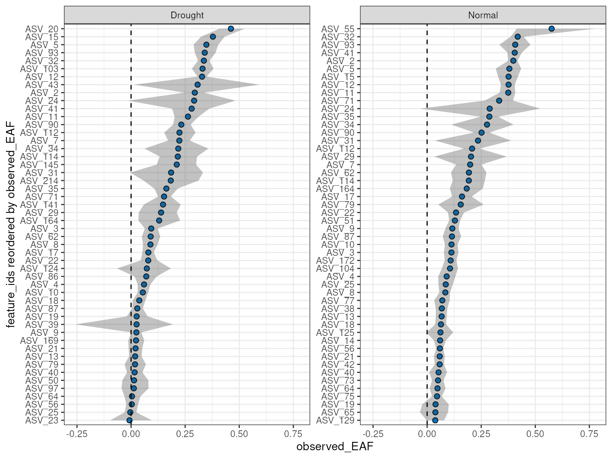
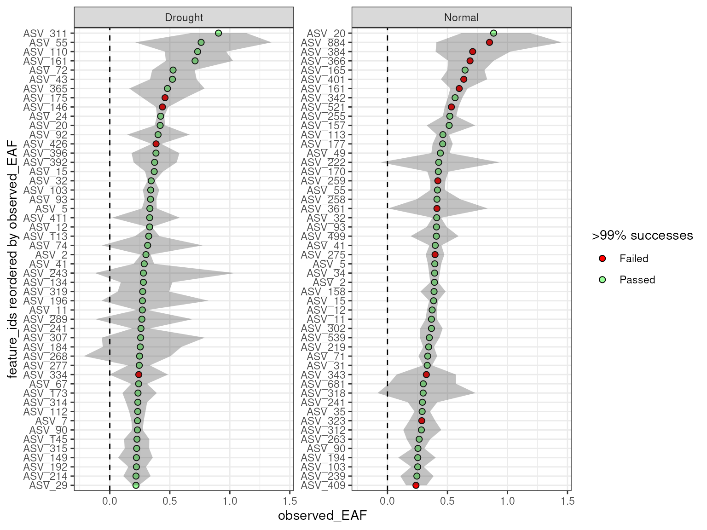
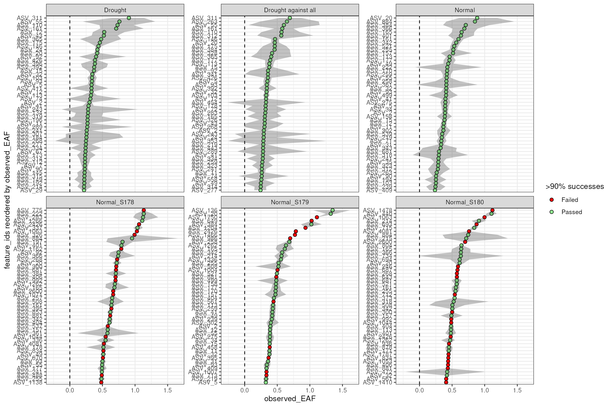

# Multiple qSIP Objects

``` r
library(dplyr)
library(ggplot2)
library(qSIP2)
packageVersion("qSIP2")
#> [1] '0.21.0'
```

## Background

In `qSIP2`, you can run the standard EAF workflow with multiple
`qsip_data` objects at the same time. This vignette will show you
different ways to create and use multiple `qsip_data` objects in the
same workflow.

## Multiple Object Structure

The format for storing multiple `qsip_data` objects is a simple named
list, where the names are a descriptive but succinct name for that
comparison, and the value is the `qsip_data` object. The list can be
created in a few different ways, including “by hand”, by formatting the
[`get_comparison_groups()`](https://jeffkimbrel.github.io/qSIP2/reference/get_comparison_groups.md)
output, or providing a dataframe to the dedicated
[`run_comparison_groups()`](https://jeffkimbrel.github.io/qSIP2/reference/run_comparison_groups.md)
function. Each of these are detailed below.

## Building the multi `qsip_data` object “by hand”

In the standard
[`vignette("qSIP_workflow")`](https://jeffkimbrel.github.io/qSIP2/articles/qSIP_workflow.md)
vignette we filtered the example object to create “normal” and “drought”
objects, and then proceeded through the workflow with these two objects
independently. However, these two objects can instead be combined using
[`list()`](https://rdrr.io/r/base/list.html) to work with both
simultaneously. We can run a validation function that will return `TRUE`
if the list is correct.

``` r
qsip_normal <- run_feature_filter(example_qsip_object,
  unlabeled_source_mat_ids = get_all_by_isotope(example_qsip_object, "12C"),
  labeled_source_mat_ids = c("S178", "S179", "S180"),
  min_unlabeled_sources = 6, min_labeled_sources = 3,
  min_unlabeled_fractions = 5, min_labeled_fractions = 5,
  quiet = TRUE
) |>
  run_resampling(with_seed = 49, quiet = TRUE, progress = FALSE) |>
  run_EAF_calculations()

qsip_drought <- run_feature_filter(example_qsip_object,
  unlabeled_source_mat_ids = get_all_by_isotope(example_qsip_object, "12C"),
  labeled_source_mat_ids = c("S200", "S201", "S202", "S203"),
  min_unlabeled_sources = 6, min_labeled_sources = 3,
  min_unlabeled_fractions = 5, min_labeled_fractions = 5,
  quiet = TRUE
) |>
  run_resampling(with_seed = 50, quiet = TRUE, progress = FALSE) |>
  run_EAF_calculations()

qsip_list_1 = list("Normal" = qsip_normal, 
                          "Drought" = qsip_drought)

is_qsip_data_list(qsip_list_1)
#> [1] TRUE
```

The list objects now holds both `qsip_data` objects, but each can be
accessed by name (e.g. `qsip_list_1$Normal`) if needed. When building by
hand, the main benefit of combining multiple objects together is that
you get shared reporting with summary functions like
[`summarize_EAF_values()`](https://jeffkimbrel.github.io/qSIP2/reference/summarize_EAF_values.md)
and
[`plot_EAF_values()`](https://jeffkimbrel.github.io/qSIP2/reference/plot_EAF_values.md).

``` r
summarize_EAF_values(qsip_list_1)
```

    #> Confidence level = 0.9

| group   | feature_id | observed_EAF | mean_resampled_EAF |      lower |      upper | labeled_resamples | unlabeled_resamples | labeled_sources | unlabeled_sources |
|:--------|:-----------|-------------:|-------------------:|-----------:|-----------:|------------------:|--------------------:|----------------:|------------------:|
| Normal  | ASV_1      |   -0.0153107 |         -0.0162090 | -0.0524399 |  0.0239385 |              1000 |                1000 |               3 |                 8 |
| Drought | ASV_1      |   -0.0333856 |         -0.0322146 | -0.0792106 |  0.0219181 |              1000 |                1000 |               4 |                 8 |
| Normal  | ASV_10     |    0.1126260 |          0.1116218 |  0.0823812 |  0.1405383 |              1000 |                1000 |               3 |                 8 |
| Drought | ASV_10     |    0.0543136 |          0.0542462 |  0.0305884 |  0.0788885 |              1000 |                1000 |               4 |                 8 |
| Drought | ASV_100    |   -0.0892684 |         -0.0885048 | -0.1485629 | -0.0283228 |              1000 |                1000 |               3 |                 7 |
| Normal  | ASV_102    |   -0.0080214 |         -0.0090271 | -0.0746514 |  0.0546485 |              1000 |                1000 |               3 |                 8 |

First few rows from
[`summarize_EAF_values()`](https://jeffkimbrel.github.io/qSIP2/reference/summarize_EAF_values.md)

In the table above, you can see that the `feature_id` column is repeated
for each group.

``` r
plot_EAF_values(qsip_list_1,
                top = 50,
                error = "ribbon")
#> Confidence level = 0.9
```



Other helper functions can be used on the list as well.

``` r
n_resamples(qsip_list_1)
#> # A tibble: 2 × 2
#>   group   n_resamples
#>   <chr>         <dbl>
#> 1 Normal         1000
#> 2 Drought        1000
resample_seed(qsip_list_1)
#> # A tibble: 2 × 2
#>   group    seed
#>   <chr>   <dbl>
#> 1 Normal     49
#> 2 Drought    50
```

## Dataframe-based multi `qsip_data` object

Although building the list by hand can be useful in organizing the
output, the functionality of the list structure really shines when you
start with a dataframe of comparisons you want to make. This workflow
will do all of the steps from the initial, unfiltered `qsip_data`
objects without the need to manually build each comparison object.

### Dataframe Structure

The dataframe has a simple structure, and requires at a minimum three
columns. The `group` column is the name of the comparison group, and the
`unlabeled` and `labeled` columns are vectors of the
`source_material_id`s to use in the comparison. Each row of the
dataframe will be a separate comparison group.

### Modifying `get_comparison_groups()` output

Recall that
[`get_comparison_groups()`](https://jeffkimbrel.github.io/qSIP2/reference/get_comparison_groups.md)
attempts to guess the relevant comparison groups using the metadata. For
the example qsip object, when grouping by “Moisture” we get

``` r
get_comparison_groups(example_qsip_object, group = "Moisture")
#> # A tibble: 2 × 3
#>   Moisture `12C`                  `13C`                 
#>   <chr>    <chr>                  <chr>                 
#> 1 Normal   S149, S150, S151, S152 S178, S179, S180      
#> 2 Drought  S161, S162, S163, S164 S200, S201, S202, S203
```

The output is already in our desired format, and all that is needed is
some slight tweaking of the column names using
[`dplyr::select()`](https://dplyr.tidyverse.org/reference/select.html)
(or
[`dplyr::rename()`](https://dplyr.tidyverse.org/reference/rename.html)).

``` r
get_comparison_groups(example_qsip_object, group = "Moisture") |> 
  dplyr::select("group" = Moisture, "unlabeled" = "12C", "labeled" = "13C")
#> # A tibble: 2 × 3
#>   group   unlabeled              labeled               
#>   <chr>   <chr>                  <chr>                 
#> 1 Normal  S149, S150, S151, S152 S178, S179, S180      
#> 2 Drought S161, S162, S163, S164 S200, S201, S202, S203
```

This dataframe can be passed directly to
[`run_comparison_groups()`](https://jeffkimbrel.github.io/qSIP2/reference/run_comparison_groups.md)
to create the multi `qsip_data` object.
[`run_comparison_groups()`](https://jeffkimbrel.github.io/qSIP2/reference/run_comparison_groups.md)
requires the dataframe and a `qsip_data` object as the first two
arguments. It has three additional optional arguments that globally
apply to all comparisons: `allow_failures` (*boolean*), `seed`
(*integer*), and `resamples` (*integer*).

``` r
qsip_list_2 = get_comparison_groups(example_qsip_object, group = "Moisture") |> 
  dplyr::select("group" = Moisture, "unlabeled" = "12C", "labeled" = "13C") |>
  run_comparison_groups(example_qsip_object, 
                        seed = 99,
                        allow_failures = TRUE)
#> Finished groups ■■■■■■■■■■■■■■■■                  50%
#> Finished groups ■■■■■■■■■■■■■■■■■■■■■■■■■■■■■■■  100%
#> 

is_qsip_data_list(qsip_list_2)
#> [1] TRUE
```

Plotting the values here should give almost identical results (within
sampling error) to the previous plot, but this time we have enabled the
`allow_failures` option so we get resampling success as well.

``` r
plot_EAF_values(qsip_list_2,
                top = 50,
                success_ratio = 0.99,
                error = "ribbon")
#> Confidence level = 0.9
```



### Custom dataframe for ultimate control

It is possible to make a dataframe from scratch (e.g. as an excel
spreadsheet) to give even more fine-grain control over each comparison.
Here, rather than setting parameters that will be treated as identical
for all comparisons (like `seed = 99` above), here additional columns
can be used to set the values independently per row. An example
dataframe is included in the `qSIP2` package called
`example_group_dataframe`. This dataframe is shown below, but with some
columns temporarily removed for brevity (those columns will be discussed
later).

``` r
example_group_dataframe
```

| group               | unlabeled              | labeled                | allow_failures | resamples | seed |
|:--------------------|:-----------------------|:-----------------------|:---------------|----------:|-----:|
| Normal              | S149, S150, S151, S152 | S178, S179, S180       | T              |       500 |  100 |
| Drought             | S161, S162, S163, S164 | S200, S201, S202, S203 | T              |      1000 |  101 |
| Drought against all | 12C                    | S200, S201, S202, S203 | T              |      1000 |  102 |
| Normal_S178         | S149, S150, S151, S152 | S178                   | T              |      1000 |  103 |
| Normal_S179         | S149, S150, S151, S152 | S179                   | T              |      1000 |  104 |
| Normal_S180         | S149, S150, S151, S152 | S180                   | T              |      1000 |  105 |

Example dataframe with some columns removed

This dataframe shows the customizability of the format, including
retaining the ability to use isotope terms like “12C” to grab all source
material IDs with that isotope.

``` r
qsip_list_3 = example_group_dataframe |>
  run_comparison_groups(example_qsip_object)
#> Finished groups ■■■■■■                            17%
#> Finished groups ■■■■■■■■■■■                       33%
#> Finished groups ■■■■■■■■■■■■■■■■                  50%
#> Finished groups ■■■■■■■■■■■■■■■■■■■■■             67%
#> Finished groups ■■■■■■■■■■■■■■■■■■■■■■■■■■        83%
#> Finished groups ■■■■■■■■■■■■■■■■■■■■■■■■■■■■■■■  100%
#> 

resample_seed(qsip_list_3)
#> # A tibble: 6 × 2
#>   group                seed
#>   <chr>               <dbl>
#> 1 Drought               101
#> 2 Drought against all   102
#> 3 Normal                100
#> 4 Normal_S178           103
#> 5 Normal_S179           104
#> 6 Normal_S180           105
```

If you use the additional arguments in
[`run_comparison_groups()`](https://jeffkimbrel.github.io/qSIP2/reference/run_comparison_groups.md)
then they will override the values in the dataframe.

``` r
qsip_list_4 = example_group_dataframe |>
  run_comparison_groups(example_qsip_object,
                        seed = 42)
#> Finished groups ■■■■■■                            17%
#> Finished groups ■■■■■■■■■■■                       33%
#> Finished groups ■■■■■■■■■■■■■■■■                  50%
#> Finished groups ■■■■■■■■■■■■■■■■■■■■■             67%
#> Finished groups ■■■■■■■■■■■■■■■■■■■■■■■■■■        83%
#> Finished groups ■■■■■■■■■■■■■■■■■■■■■■■■■■■■■■■  100%
#> 
resample_seed(qsip_list_4)
#> # A tibble: 6 × 2
#>   group                seed
#>   <chr>               <dbl>
#> 1 Drought                42
#> 2 Drought against all    42
#> 3 Normal                 42
#> 4 Normal_S178            42
#> 5 Normal_S179            42
#> 6 Normal_S180            42
```

The are 4 additional dataframe columns that
[`run_comparison_groups()`](https://jeffkimbrel.github.io/qSIP2/reference/run_comparison_groups.md)
will accept: `min_unlabeled_sources`, `min_labeled_sources`,
`min_unlabeled_fractions`, and `min_labeled_fractions`. These columns
are used to set the minimum number of sources and fractions required for
each comparison. The full example dataframe does additionally contain
these columns.

``` r
summarize_EAF_values(qsip_list_3) |>
  filter(feature_id == "ASV_1")
#> Confidence level = 0.9
#> # A tibble: 6 × 10
#>   group              feature_id observed_EAF mean_resampled_EAF   lower    upper
#>   <chr>              <chr>             <dbl>              <dbl>   <dbl>    <dbl>
#> 1 Drought            ASV_1         -0.0492             -0.0489  -0.108   0.0113 
#> 2 Drought against a… ASV_1         -0.0334             -0.0328  -0.0798  0.0195 
#> 3 Normal             ASV_1          0.000455            0.00138 -0.0326  0.0357 
#> 4 Normal_S178        ASV_1          0.0410              0.0421   0.0214  0.0606 
#> 5 Normal_S179        ASV_1         -0.0256             -0.0251  -0.0454 -0.00603
#> 6 Normal_S180        ASV_1         -0.0140             -0.0141  -0.0378  0.00564
#> # ℹ 4 more variables: labeled_resamples <int>, unlabeled_resamples <int>,
#> #   labeled_sources <int>, unlabeled_sources <int>
```

But, keep in mind that each row of the dataframe will be filtered
differently, and therefore some `feature_id`s could be missing from
certain comparisons. For example, ASV_311 only appears in the two
“Drought” comparisons.

``` r
summarize_EAF_values(qsip_list_3) |>
  filter(feature_id == "ASV_311")
#> Confidence level = 0.9
#> # A tibble: 2 × 10
#>   group feature_id observed_EAF mean_resampled_EAF lower upper labeled_resamples
#>   <chr> <chr>             <dbl>              <dbl> <dbl> <dbl>             <int>
#> 1 Drou… ASV_311           0.906              0.903 0.650 1.14               1000
#> 2 Drou… ASV_311           0.693              0.693 0.535 0.867              1000
#> # ℹ 3 more variables: unlabeled_resamples <int>, labeled_sources <int>,
#> #   unlabeled_sources <int>
```

And although you can plot all together, more than a few objects might
make the plots harder to read. But, because it is a simple list you can
always still access the individual objects if needed using the `$`
operator (e.g. `qsip_list_3$Drought`) or `[]` brackets
(e.g. `qsip_list_3[c("Drought", "Normal")]`).

``` r
plot_EAF_values(qsip_list_3[c("Drought", "Normal")],
                error = "ribbon",
                top = 50)
#> Confidence level = 0.9
```


