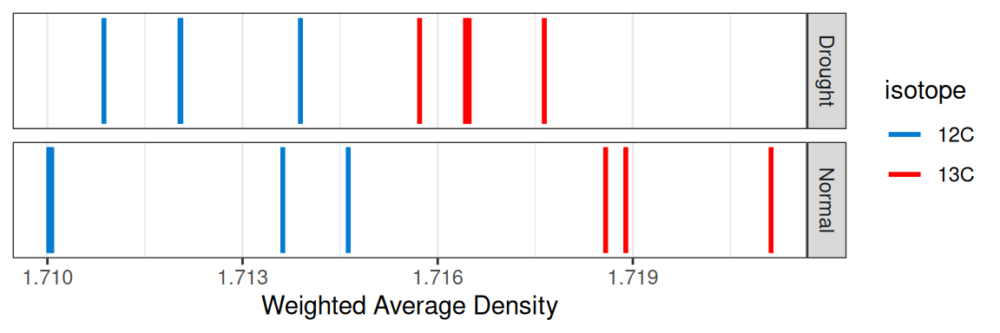
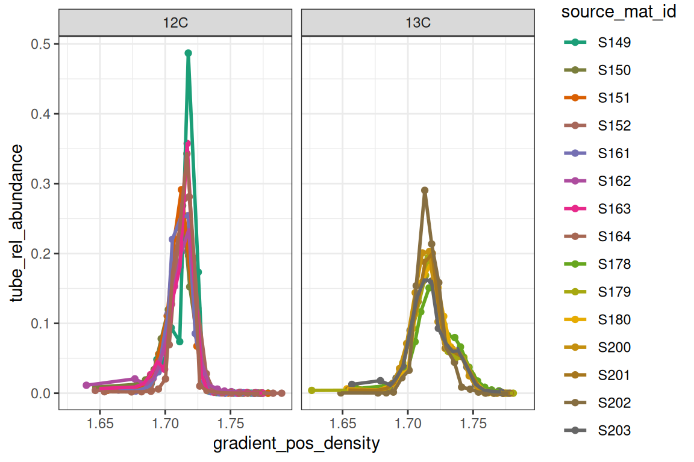
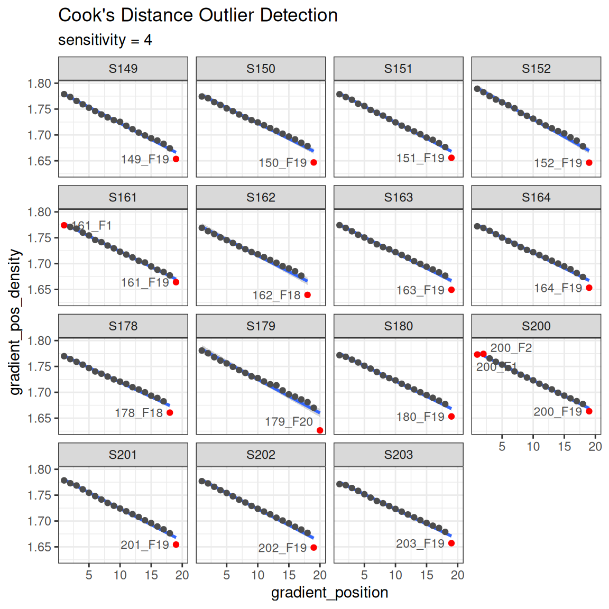
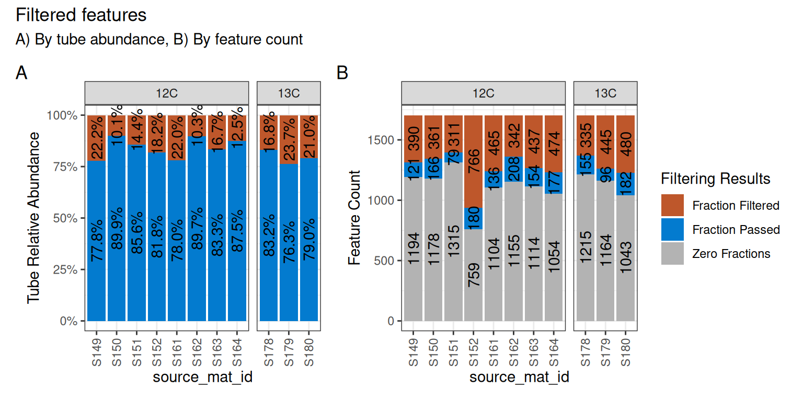
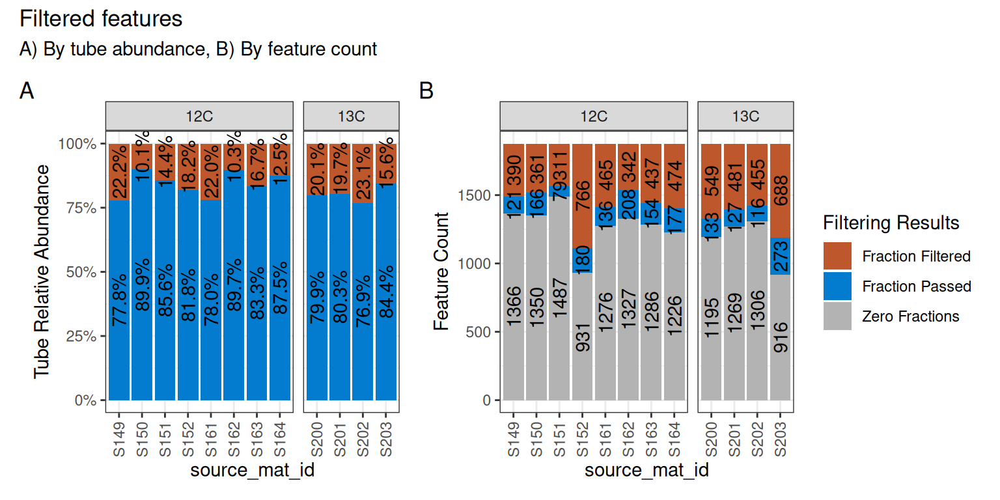
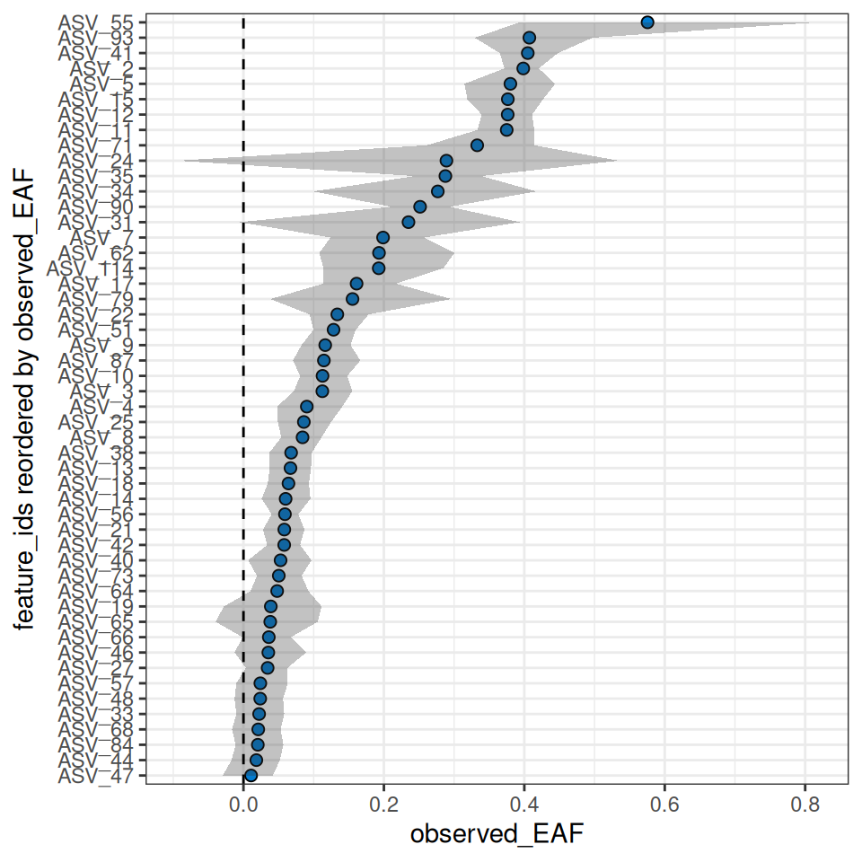
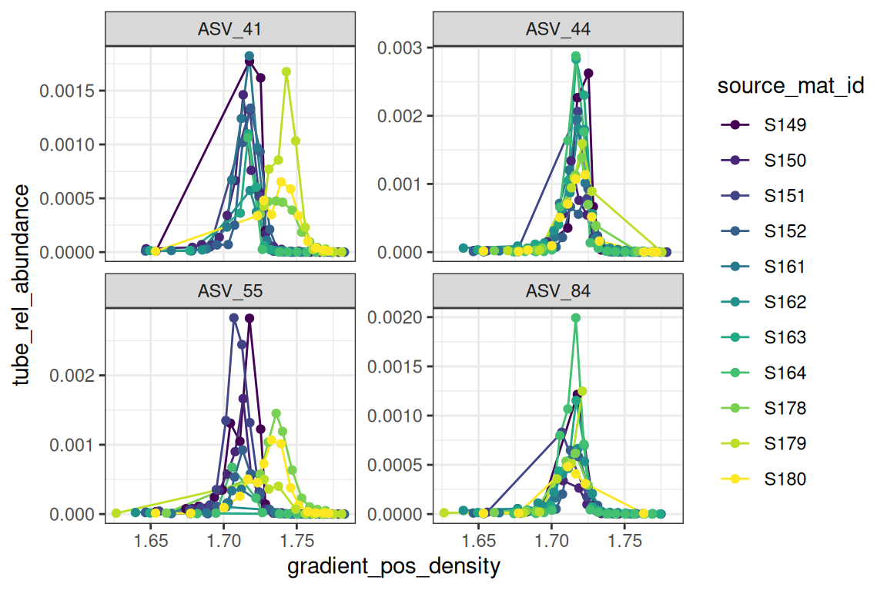
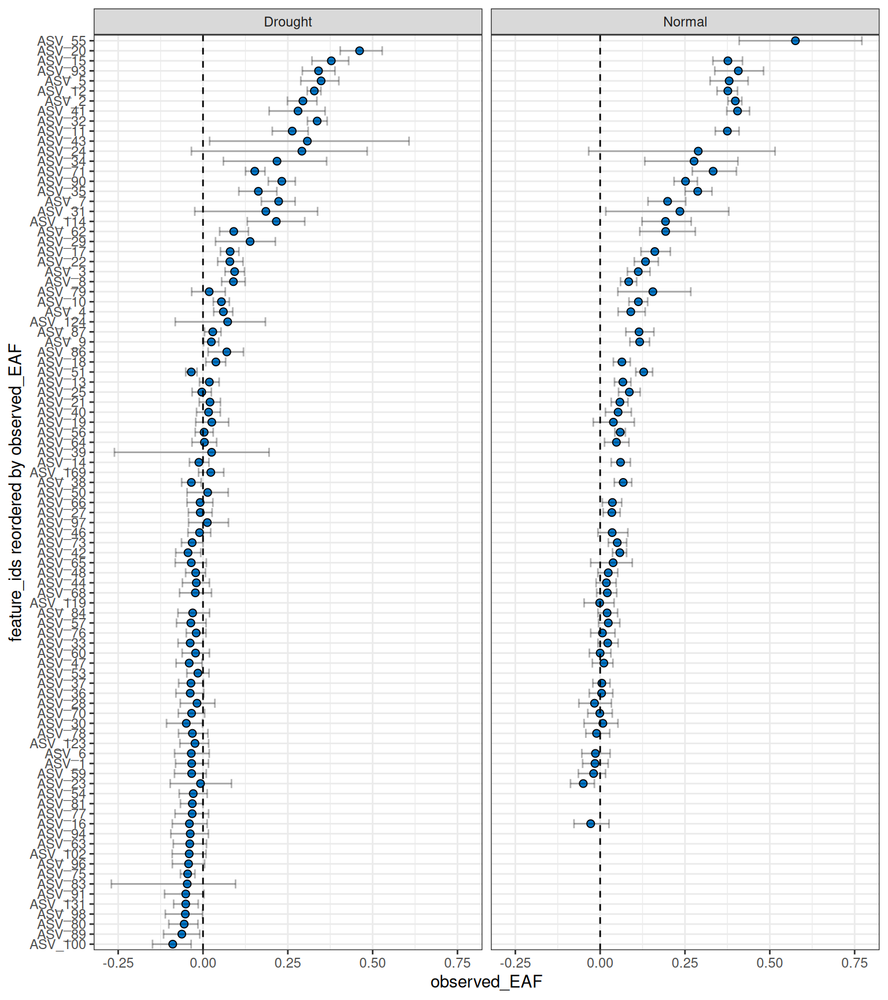

# Standard qSIP EAF Workflow

``` r
library(dplyr)
library(ggplot2)
library(qSIP2)
packageVersion("qSIP2")
#> [1] '0.23.4'
```

## Background

A complete quantitative stable isotope probing (qSIP) workflow using the
`qSIP2` package starts with three input files and ends with calculated
excess atom fraction (EAF) values along with a ton of intermediate data.
This vignette will be a high-level walk through of the major steps with
links to more specific vignettes where more detail is appropriate.

## The input files

Preparing and formatting the input files is often the most tedious part
of any analysis. Our goal with the rigid (and opinionated) requirements
imposed by `qSIP2` will hopefully streamline the creation of these
files, and automated validation checks can remove many of the common
sources of error or confusion. Where appropriate, `qSIP2` and this
documentation uses MISIP terminology[¹](#fn1).

### Source data

The source data is the highest level of metadata with a row
corresponding to each original experimental or source material object.
An example source dataframe is included in the `qSIP2` package called
`example_source_df`.

| source | total_copies_per_g | total_dna | Isotope | Moisture | isotopolog |
|:-------|-------------------:|----------:|:--------|:---------|:-----------|
| S149   |           34838665 |  74.46539 | 12C     | Normal   | glucose    |
| S150   |           53528072 | 109.01522 | 12C     | Normal   | glucose    |
| S151   |           95774992 | 182.16852 | 12C     | Normal   | glucose    |
| S152   |            9126192 |  23.68963 | 12C     | Normal   | glucose    |
| S161   |           41744046 |  67.62552 | 12C     | Drought  | glucose    |
| S162   |           49402713 |  94.21217 | 12C     | Drought  | glucose    |

Table 1: The first few rows of `example_source_df`

There are a few required columns for valid source data including a
unique ID (`source_mat_id`), an `isotope` and `isotopolog` designation
for the substrate that had the label. Additional columns can be added as
necessary (e.g. `Moisture`) for grouping and filtering later in the
process.

For growth calculations there are three additional requirements:
`timepoint`, `total_abundance` and `volume`. These are not necessary for
the standard EAF workflow and will instead be addressed in the [growth
vignette](https://jeffkimbrel.github.io/qSIP2/articles/growth.md).

Once the dataframe is ready, the next step is to convert it to a
`qsip_source_data` object. This is one of the main `qSIP2` objects to
hold and validate the data. Each of the required columns of metadata is
assigned to a column in your dataframe. For example, below the “Isotope”
column in the dataframe is assigned to the `isotope` parameter in the
`qsip_source_data` object.

``` r
source_object <- qsip_source_data(example_source_df,
  isotope = "Isotope",
  isotopolog = "isotopolog",
  source_mat_id = "source"
)

class(source_object)
#> [1] "qSIP2::qsip_source_data" "S7_object"
```

This object modifies some of the column names to standard names as
supplied in the above function.

| Original Headers   | Modified Headers   |
|:-------------------|:-------------------|
| source             | source_mat_id      |
| total_copies_per_g | total_copies_per_g |
| total_dna          | total_dna          |
| Isotope            | isotope            |
| Moisture           | Moisture           |
| isotopolog         | isotopolog         |

If the column names in the dataframe already match the expected standard
names, then you can skip assigning them and they should be identified
correctly.

A dataframe with the original headers can be recovered using the
[`get_dataframe()`](https://jeffkimbrel.github.io/qSIP2/reference/get_dataframe.md)
method with the `original_headers = T` option.

``` r
df <- get_dataframe(source_object, original_headers = TRUE)
```

| Isotope | isotopolog | source | total_copies_per_g | total_dna | Moisture |
|:--------|:-----------|:-------|-------------------:|----------:|:---------|
| 12C     | glucose    | S149   |           34838665 |  74.46539 | Normal   |
| 12C     | glucose    | S150   |           53528072 | 109.01522 | Normal   |
| 12C     | glucose    | S151   |           95774992 | 182.16852 | Normal   |
| 12C     | glucose    | S152   |            9126192 |  23.68963 | Normal   |
| 12C     | glucose    | S161   |           41744046 |  67.62552 | Drought  |
| 12C     | glucose    | S162   |           49402713 |  94.21217 | Drought  |

See the [source data
vignette](https://jeffkimbrel.github.io/qSIP2/articles/source_data.md)
for more details.

### Sample data

The sample metadata is the next level of detail with one row for each
fraction, or one row for each set of fastq files that were sequenced. If
you have “bulk” or unfractionated sequenced reads, these are also
considered *samples*. Basically, anything that lives as columns in your
ASV/feature table are considered samples.

| sample | source | Fraction | density_g_ml |  dna_conc | avg_16S_g_soil |
|:-------|:-------|---------:|-------------:|----------:|---------------:|
| 149_F1 | S149   |        1 |     1.778855 | 0.0000000 |      4473.7081 |
| 149_F2 | S149   |        2 |     1.773391 | 0.0000000 |       986.6581 |
| 149_F3 | S149   |        3 |     1.765742 | 0.0000000 |      4002.7026 |
| 149_F4 | S149   |        4 |     1.759185 | 0.0000000 |      3959.7283 |
| 149_F5 | S149   |        5 |     1.752629 | 0.0012413 |      5725.7319 |
| 149_F6 | S149   |        6 |     1.746072 | 0.0128156 |      7566.2722 |

Table 2: The first few rows of `example_sample_df`

Again, there are several necessary columns for valid sample data,
including a unique sample ID (`sample_id`), the source they came from
(`source_mat_id`), the fraction ID (`gradient_position`), the fraction
density (`gradient_pos_density`) and a measure of abundance (total DNA
or qPCR copy number) in that fraction (`gradient_pos_amt`).

An additional column that can be derived is the percent abundance of
your total sample that is found in each of the fractions. The
[`add_gradient_pos_rel_amt()`](https://jeffkimbrel.github.io/qSIP2/reference/add_gradient_pos_rel_amt.md)
function can help calculate that by dividing each fraction abundance by
the total abundance for each source and putting it in a
`gradient_pos_rel_amt` column.

But there is no need to do this if you already have the relative amounts
calculated in your dataframe.

``` r
sample_df <- example_sample_df |>
  add_gradient_pos_rel_amt(source_mat_id = "source", amt = "avg_16S_g_soil")
```

| sample | source | Fraction | density_g_ml |  dna_conc | avg_16S_g_soil | gradient_pos_rel_amt |
|:-------|:-------|---------:|-------------:|----------:|---------------:|---------------------:|
| 149_F1 | S149   |        1 |     1.778855 | 0.0000000 |      4473.7081 |            0.0001284 |
| 149_F2 | S149   |        2 |     1.773391 | 0.0000000 |       986.6581 |            0.0000283 |
| 149_F3 | S149   |        3 |     1.765742 | 0.0000000 |      4002.7026 |            0.0001149 |
| 149_F4 | S149   |        4 |     1.759185 | 0.0000000 |      3959.7283 |            0.0001137 |
| 149_F5 | S149   |        5 |     1.752629 | 0.0012413 |      5725.7319 |            0.0001643 |
| 149_F6 | S149   |        6 |     1.746072 | 0.0128156 |      7566.2722 |            0.0002172 |

Table 3: Additional `gradient_pos_rel_amt` column added

Again, we make a `qSIP2` object for this data, this time as a
`qsip_sample_data` object. The columns in the dataframe are assigned to
the appropriate parameters, and any column names exactly matching the
parameter name will automatically be identified. Similar to the
`source_data` above, the names in the `sample_data` object will be
modified from the original names to the standardized names.

``` r
sample_object <- qsip_sample_data(sample_df,
  sample_id = "sample",
  source_mat_id = "source",
  gradient_position = "Fraction",
  gradient_pos_density = "density_g_ml",
  gradient_pos_amt = "avg_16S_g_soil",
  gradient_pos_rel_amt = "gradient_pos_rel_amt"
)

class(sample_object)
#> [1] "qSIP2::qsip_sample_data" "S7_object"
```

See the [sample data
vignette](https://jeffkimbrel.github.io/qSIP2/articles/sample_data.md)
for more information including the built-in validations.

### Feature data

Finally, the last of the three necessary input files is a feature
abundance table, aka “OTU table” or “ASV table”. The format of this
dataframe has the unique feature IDs in the first column, and an
additional column for each sample. Each row then contains the whole
number (non-normalized) counts of each feature in each sample. If your
features are MAGs, then you may instead of coverages or some other
pre-normalized value in your feature table instead of sequence counts.

For now, the validation step defaults to requiring all values be
`counts` (positive integers), but other `type` options include
`coverage` (for working with MAGs or metagenomes), `relative` if you
already have relative abundances and `normalized` if you have spike-ins
or another method that determines the correct abundance in each sample.

| ASV   | 149_F1 | 149_F2 | 149_F3 | 149_F4 | 149_F5 |
|:------|-------:|-------:|-------:|-------:|-------:|
| ASV_1 |   1245 |    376 |    582 |   1258 |    692 |
| ASV_2 |   1471 |    569 |    830 |   1373 |    737 |
| ASV_3 |    342 |    152 |    211 |    389 |    218 |
| ASV_4 |    288 |    119 |    161 |    294 |    157 |
| ASV_5 |    317 |    108 |     95 |    292 |    164 |
| ASV_6 |    201 |     73 |    130 |    250 |    112 |

Table 4: First bit of `example_feature_df`

``` r
feature_object <- qsip_feature_data(example_feature_df,
  feature_id = "ASV"
)

class(feature_object)
#> [1] "qSIP2::qsip_feature_data" "S7_object"
```

See the [feature data
vignette](https://jeffkimbrel.github.io/qSIP2/articles/feature_data.md)
for more details.

## The `qsip_data` object

The `qsip_data` class is the main workhorse object in the `qSIP2`
package. It is built from validated versions of the three previous
objects, and is meant to be a self-contained object with all of the
necessary information for analysis.

``` r
qsip_object <- qsip_data(
  source_data = source_object,
  sample_data = sample_object,
  feature_data = feature_object
)
#> ✔ There are 15 source_mat_ids, and they are all shared between the source and sample objects.
#> ✔ There are 284 sample_ids, and they are all shared between the sample and feature objects.

class(qsip_object)
#> [1] "qSIP2::qsip_data" "S7_object"
```

This function will report if all `source_mat_id`s are shared between the
source and sample data, and if all `sample_id`s are shared between the
sample and feature data. If it reports there are some unshared ids, you
can access them with `get_unshared_ids(qsip_object)`, but note that it
is just a warning and does not stop the creation of the qSIP object.

### Visualizations

Behind the scenes, creation of this object also runs some other
calculations, particularly getting the weighted-average density (WAD)
for each feature in each source, and also the tube relative abundance of
each feature. With these, certain visualizations can be made with
built-in functions.

``` r
plot_source_wads(qsip_object, 
                 group = "Moisture")
```



Figure 1: WAD of each source, grouped by Moisture. Note that for this
example dataset the 13C just happens to have source-level WAD values
greater than the 12C, but it is generally not a concern if the 12C and
13C values are intermingled.

``` r
plot_sample_curves(qsip_object,
                   facet_by = "isotope",
                   show_wad = F)
```



Figure 2: Normalized density curves for each source_mat_id. The y-axis
is scaled to tube fraction abundance.

Another sanity check is making sure the reported density values are on a
reasonably straight line with the gradient position with a Cook’s
distance to highlight any outliers in red. Note, the ends of the
gradient are often flagged as outliers, although this may not
necessarily be the case.

``` r
plot_density_outliers(qsip_object)
```



Figure 3

### An important note about qsip_data objects

The design of the `qsip_data` object is that it is contains “slots” for
each new analysis step. Although you could create a new object for each
step of the workflow, you can assign the output of each step back to the
original object in order to keep everything together. “Printing” the
`qsip_data` object will give some summary data as well as TRUE/FALSE
flags for which steps have been done on that object.

``` r
print(qsip_object)
#> <qsip_data>
#> group: none
#> feature_id count: 2030 of 2030
#> sample_id count: 284
#> filtered: FALSE
#> resampled: FALSE
#> EAF: FALSE
#> growth: FALSE
```

## Main workflow

Now that we have a validated `qsip_data` object, we can start the main
workflow consisting of comparison grouping, filtering, resampling and
finally calculating EAF values. Note that this workflow explicitly (and
laboriously) runs through all of the steps individually, but the
preferred workflow is either piping them all together, or ideally
running the multiple objects workflow. Both of these are previewed below
with links to the full vignette.

### Comparison grouping

Your `qsip_data` object likely contains all of your data, but you may
only want to run comparisons on certain subsets. The
[`get_comparison_groups()`](https://jeffkimbrel.github.io/qSIP2/reference/get_comparison_groups.md)
function attempts to identify and suggest the sources you may want to
compare.

``` r
get_comparison_groups(qsip_object,
  group = "Moisture",
  isotope = "isotope",
  source_mat_id = "source_mat_id"
)
#> # A tibble: 2 × 3
#>   Moisture `12C`                  `13C`                 
#>   <chr>    <chr>                  <chr>                 
#> 1 Normal   S149, S150, S151, S152 S178, S179, S180      
#> 2 Drought  S161, S162, S163, S164 S200, S201, S202, S203
```

Table 5: Output of
[`get_comparison_groups()`](https://jeffkimbrel.github.io/qSIP2/reference/get_comparison_groups.md).

The `group` argument here is the most important as it will define the
rows that it thinks constitute a comparison. If you have more
complicated groupings that involve multiple columns of metadata, you can
instead run a `paste` call inside `mutate` to create combined column:

``` r
qsip_object |>
  mutate(new_column = paste(column1, column2, sep = "_")) |>
  get_comparison_groups(
    group = "new_column",
    isotope = "isotope",
    source_mat_id = "source_mat_id"
  )
```

The `isotope` argument is what defines the labeled and unlabeled values
for the comparisons. This can be more complex, particularly if you have
more than one isotopolog. For example, a study with some 13C sources,
other 15N sources, and a shared 12C/14N natural abundance source
material. Please reach out via `qSIP2` github issues for more complex
study designs.

The first row shows what “Normal” moisture groups we likely want to use
for unlabeled (S149, S150, S151 and S152) to compare to the labeled
(S178, S179 and S180). Sometimes you may also want to compare the
specific labeled samples in a group to *all* unlabeled. The `qSIP2`
package has a convenient way to get those by using the
[`get_all_by_isotope()`](https://jeffkimbrel.github.io/qSIP2/reference/get_all_by_isotope.md)
function.

``` r
get_all_by_isotope(qsip_object, "12C")
#> [1] "S149" "S150" "S151" "S152" "S161" "S162" "S163" "S164"
```

The
[`get_comparison_groups()`](https://jeffkimbrel.github.io/qSIP2/reference/get_comparison_groups.md)
function is entirely informational, but it is possible to pipe this
output into the
[`run_comparison_groups()`](https://jeffkimbrel.github.io/qSIP2/reference/run_comparison_groups.md)
function. This more advanced use in detailed in the [Multiple qSIP
Objects
vignette](https://jeffkimbrel.github.io/qSIP2/articles/multiple_objects.md).

### Filter features

The filter features step does two things. First, it is where the set of
labeled and unlabeled sources are defined for a specific comparison.
Second, it is where you can explicitly say how prevalent a feature must
be to be considered “present” in a source. In other words, you define
the parameters that a feature must be found enough of the replicate
sources, and in enough samples that you can calculate an accurate WAD
value for it.

The
[`run_feature_filter()`](https://jeffkimbrel.github.io/qSIP2/reference/run_feature_filter.md)
function takes a `qsip_data` object and these different parameters
allowing you to precisely tailor your filtering results. The more strict
the filtering, the fewer features that will pass the filter.

``` r
qsip_normal <- run_feature_filter(qsip_object,
  unlabeled_source_mat_ids = get_all_by_isotope(qsip_object, "12C"),
  labeled_source_mat_ids = c("S178", "S179", "S180"),
  min_unlabeled_sources = 6,
  min_labeled_sources = 3,
  min_unlabeled_fractions = 6,
  min_labeled_fractions = 6,
  quiet = TRUE
)
```

Note, although I said earlier you can overwrite your `qsip_data` objects
as you go, here it might make sense to create two versions for the
moisture treatments. We’ll take the original `qsip_object` and save the
filtered Normal dataset to
`qsip_normal', and the Drought to`qsip_drought\`.

Of the 1,705 features found in the “Normal” data, we can see our rather
strict filtering removed all but 64 features from the dataset.

``` r
df = get_filter_results(qsip_normal)
```

| filter_step       | features_unlabeled | features_labeled | union | intersect | unlabeled_only | labeled_only | mean_abundance_unlabeled | mean_abundance_labeled |
|:------------------|-------------------:|-----------------:|------:|----------:|---------------:|-------------:|-------------------------:|-----------------------:|
| Zero Fractions    |               1519 |             1417 |  1560 |      1376 |            143 |           41 |                0.0000000 |              0.0000000 |
| Fraction Filtered |               1440 |              830 |  1646 |       624 |            816 |          206 |                0.1579295 |              0.2053189 |
| Fraction Passed   |                299 |              209 |   346 |       162 |            137 |           47 |                0.8420705 |              0.7946811 |
| Zero Sources      |                 47 |              137 |   184 |         0 |             47 |          137 |                0.0000000 |              0.0000000 |
| Source Filtered   |                196 |              127 |   265 |        58 |            138 |           69 |                0.3167506 |              0.2163507 |
| Source Passed     |                103 |               82 |   121 |        64 |             39 |           18 |                0.7631509 |              0.6849542 |

Table 6: Detailed results of the filtering.

We can visualize these results on a per-source basis with the
[`plot_filter_results()`](https://jeffkimbrel.github.io/qSIP2/reference/plot_filter_results.md)
function.

``` r
plot_filter_results(qsip_normal)
```



Figure 4: Per-source filtering results for the “normal” dataset.

Although a large number of features were removed, we can tell that the
64 that remained actually still make up a large proportion of the total
abundance in each sample. In **A** above, the retained features (in
blue) make up ~75-85% of the total data, while the removed data (orange)
is the remaining ~15-25%.

In **B**, we can see that a surprisingly large number of features are
found 0 times in many sources (gray) and will therefore never be present
regardless of our filtering choices. And although there are are ~100-200
features that passed the filtering requirements (blue), our requirement
that `min_unlabeled_sources = 6` and `min_labeled_sources = 3` means
that only the features present in many of the blue slices will be
retained, leaving only 64 total.

Let’s do the same comparison with the drought samples.

``` r
qsip_drought <- run_feature_filter(qsip_object,
  unlabeled_source_mat_ids = get_all_by_isotope(qsip_object, "12C"),
  labeled_source_mat_ids = c("S200", "S201", "S202", "S203"),
  min_unlabeled_sources = 6,
  min_labeled_sources = 3,
  min_unlabeled_fractions = 6,
  min_labeled_fractions = 6,
  quiet = TRUE
)
```

And only 89 features were retained in the Drought dataset.

``` r
plot_filter_results(qsip_drought)
```



Figure 5: Per-source filtering results for the “drought” dataset.

Strictly speaking, there is no requirement to do strict filtering, and
it is possible to execute
[`run_feature_filter()`](https://jeffkimbrel.github.io/qSIP2/reference/run_feature_filter.md)
with all parameters set to `1`. Filtering was originally recommended
because it dramatically sped up the compute time, but running all vs. a
subset of features in `qSIP2` has a minimal impact. Further, setting all
values to `1` and utilizing the `allow_failures` flag in the resampling
step can provide an alternative way of deciding which features to keep,
rather than just their prevalence amongst sources/samples. More
information is provided in the resampling section below, or the
[resampling
vignette](https://jeffkimbrel.github.io/qSIP2/articles/resampling.md).

Importantly, since the relative abundances have already been calculated
for each feature, the subsequent steps in the qSIP pipeline keep each
feature’s computations independent, and the results for a specific
feature will be identical regardless of whether other features are
included or filtered out.

### Resampling

The weighted average density (WAD) values were automatically calculated
during the creation of the `qsip_data` object earlier. In order to
calculate the confidence interval for the EAF values, we first need to
run a resampling/bootstrapping procedure on the WAD values. For example,
a feature found in 6 unlabeled sources will have 6 WAD values, and these
6 WAD values are resampled many times to obtain bootstrapped mean WAD
values.

``` r
qsip_normal <- run_resampling(qsip_normal,
  resamples = 1000,
  with_seed = 17,
  progress = FALSE
)
#> Warning: 1 unlabeled and 0 labeled feature_ids had resampling failures.
#> ℹ Run `get_resample_counts()` or `plot_successful_resamples()` on your
#>   <qsip_data> object to inspect.
```

As this step requires some random sampling it is good practice to set
the “seed”. Rather than doing this outside of the function, you can pass
the seed as an argument. If you leave blank, it will generate a random
seed. The seed will generate the same results each time you run the
resampling process.

``` r
qsip_normal_17_again <- run_resampling(qsip_normal,
  resamples = 1000,
  with_seed = 17,
  progress = FALSE
)
#> Warning: 1 unlabeled and 0 labeled feature_ids had resampling failures.
#> ℹ Run `get_resample_counts()` or `plot_successful_resamples()` on your
#>   <qsip_data> object to inspect.

# two runs are identical
identical(qsip_normal, qsip_normal_17_again)
#> [1] TRUE
identical(qsip_normal@resamples$l[[334]], qsip_normal_17_again@resamples$l[[334]])
#> [1] TRUE

# but individual resamplings within are different
identical(qsip_normal@resamples$l[[1]], qsip_normal@resamples$l[[2]])
#> [1] FALSE
```

Ressampling of the drought dataset. Notice at this step we are
overwriting the original `qsip_drought` with the results of
[`run_resampling()`](https://jeffkimbrel.github.io/qSIP2/reference/run_resampling.md),
rather than creating new objects.

``` r
qsip_drought <- run_resampling(qsip_drought,
  resamples = 1000,
  with_seed = 17,
  progress = FALSE
)
#> Warning: 3 unlabeled and 0 labeled feature_ids had resampling failures.
#> ℹ Run `get_resample_counts()` or `plot_successful_resamples()` on your
#>   <qsip_data> object to inspect.
```

It is possible to get a resampling error if your filtering is too
strict. If so, consult the [resampling
vignette](https://jeffkimbrel.github.io/qSIP2/articles/resampling.md)
and consider running with `allow_failures = T`.

### EAF calculations

And we are finally at the last main step, calculating and summarizing
the excess atom fraction (EAF) values. There are two functions to run,
the first
([`run_EAF_calculations()`](https://jeffkimbrel.github.io/qSIP2/reference/run_EAF_calculations.md))
that calculate EAF for the observed data and all resamplings, and the
second
([`summarize_EAF_values()`](https://jeffkimbrel.github.io/qSIP2/reference/summarize_EAF_values.md))
that summarizes that data at a chosen confidence interval. These are
split into two functions simply because the
[`run_EAF_calculations()`](https://jeffkimbrel.github.io/qSIP2/reference/run_EAF_calculations.md)
can take a little longer, allowing different parameters to be tried in
[`summarize_EAF_values()`](https://jeffkimbrel.github.io/qSIP2/reference/summarize_EAF_values.md)
without having to recalculate everything. More more information see the
[EAF vignette](https://jeffkimbrel.github.io/qSIP2/articles/EAF.md).

We’ll also
[`mutate()`](https://dplyr.tidyverse.org/reference/mutate.html) to add
the original Moisture condition to each dataframe before we combine
them. Note, there is a better way to run and get results with multiple
`qSIP2` objects - more details below.

``` r
qsip_normal <- run_EAF_calculations(qsip_normal)
qsip_drought <- run_EAF_calculations(qsip_drought)

normal <- summarize_EAF_values(qsip_normal, confidence = 0.95) |>
  mutate(Moisture = "Normal")
#> Confidence level = 0.95

drought <- summarize_EAF_values(qsip_drought, confidence = 0.95) |>
  mutate(Moisture = "Drought")
#> Confidence level = 0.95

eaf <- rbind(normal, drought)
```

We can plot the top 50 by each moisture condition.

``` r
plot_EAF_values(qsip_normal, 
                top = 50, 
                confidence = 0.95, 
                error = "ribbon")
#> Confidence level = 0.95
```



Figure 6: EAF of the top 50 features in the Normal moisture dataset

The
[`plot_feature_curves()`](https://jeffkimbrel.github.io/qSIP2/reference/plot_feature_curves.md)
function allows us to plot the tube relative abundances for specific
feature IDs. Let’s look at two with high EAF values, and two with low
values.

``` r
plot_feature_curves(qsip_normal,
  feature_ids = c("ASV_55", "ASV_84", "ASV_41", "ASV_44")
)
```



Figure 7: Density curves of selected features

### Delta EAF

To determine if there are any differences in how a feature responds in
different treatments, we can run the delta EAF workflow. This workflow
is detailed in the [delta EAF
vignette](https://jeffkimbrel.github.io/qSIP2/articles/delta_EAF.md).

The trick is to make a [`list()`](https://rdrr.io/r/base/list.html) of
multiple objects with a name that reflects their grouping.

``` r
qsip_list = list("Normal" = qsip_normal,
                 "Drought" = qsip_drought)
```

Then, the
[`run_delta_EAF_contrasts()`](https://jeffkimbrel.github.io/qSIP2/reference/run_delta_EAF_contrasts.md)
function will infer the proper contrasts (there is only one in this
case) and will assign which is the control and which is the treatment.
See the vignette for more control over these decisions.

``` r
df = run_delta_EAF_contrasts(qsip_list, confidence = 0.95)
#> ℹ `contrasts` not given so running all-by-all
#> ℹ Confidence level = 0.95
#> ! there were 0 contrast and 1 bs_pval result messages
```

| feature_id | contrast          |      delta |      lower |     upper |        sd | bs_pval | bs_pval_message |      pval | contrast_message |
|:-----------|:------------------|-----------:|-----------:|----------:|----------:|--------:|:----------------|----------:|:-----------------|
| ASV_1      | Drought vs Normal |  0.0180749 | -0.0546814 | 0.0969191 | 0.0381461 |   0.668 | NA              | 0.6356180 | NA               |
| ASV_10     | Drought vs Normal |  0.0583124 |  0.0136634 | 0.1004436 | 0.0224994 |   0.006 | NA              | 0.0095494 | NA               |
| ASV_11     | Drought vs Normal |  0.1119790 |  0.0375634 | 0.1885486 | 0.0385194 |   0.000 | NA              | 0.0036482 | NA               |
| ASV_114    | Drought vs Normal | -0.0234184 | -0.1607945 | 0.1180637 | 0.0699282 |   0.702 | NA              | 0.7377065 | NA               |
| ASV_12     | Drought vs Normal |  0.0482223 |  0.0031208 | 0.0895461 | 0.0225526 |   0.036 | NA              | 0.0324997 | NA               |
| ASV_13     | Drought vs Normal |  0.0482378 |  0.0001856 | 0.0936535 | 0.0235292 |   0.048 | NA              | 0.0403524 | NA               |

Just looking at a few of these, the delta is the difference in EAF value
for those features. Since the function “guessed” the contrasts and set
as “Drought vs Normal”, this is saying “Drought” is the control, and the
delta is reported as \\Normal - Drought\\, so a positive number means
higher in the Normal. The lower/upper values are the 95% CI of the
bootstrap values, and `bs_pval` is the p-value under the null hypothesis
that the true delta is approximately zero.

## Working with multiple qSIP objects

It is possible to work with multiple `qsip_data` objects if they are in
a list. This is detailed in the [multiple objects
vignette](https://jeffkimbrel.github.io/qSIP2/articles/multiple_objects.md),
but here is a sneak peak where we can use the existing
[`summarize_EAF_values()`](https://jeffkimbrel.github.io/qSIP2/reference/summarize_EAF_values.md)
or
[`plot_EAF_values()`](https://jeffkimbrel.github.io/qSIP2/reference/plot_EAF_values.md)
functions.

Like above in the delta EAF section, this also involves using a list of
`qsip_data` objects.

``` r
df = summarize_EAF_values(qsip_list) 
#> Confidence level = 0.9
```

| group   | feature_id | observed_EAF | mean_resampled_EAF |      lower |      upper |  pval | labeled_resamples | unlabeled_resamples | labeled_sources | unlabeled_sources |
|:--------|:-----------|-------------:|-------------------:|-----------:|-----------:|------:|------------------:|--------------------:|----------------:|------------------:|
| Normal  | ASV_1      |   -0.0153107 |         -0.0157044 | -0.0516543 |  0.0236518 | 0.470 |              1000 |                1000 |               3 |                 8 |
| Drought | ASV_1      |   -0.0333856 |         -0.0330890 | -0.0808509 |  0.0161212 | 0.284 |              1000 |                1000 |               4 |                 8 |
| Normal  | ASV_10     |    0.1126260 |          0.1121874 |  0.0848992 |  0.1400368 | 0.000 |              1000 |                1000 |               3 |                 8 |
| Drought | ASV_10     |    0.0543136 |          0.0541364 |  0.0303215 |  0.0776436 | 0.000 |              1000 |                1000 |               4 |                 8 |
| Drought | ASV_100    |   -0.0892684 |         -0.0895131 | -0.1488307 | -0.0349891 | 0.016 |              1000 |                1000 |               3 |                 7 |
| Drought | ASV_102    |   -0.0407091 |         -0.0407609 | -0.0907747 |  0.0088904 | 0.168 |              1000 |                1000 |               4 |                 8 |
| Normal  | ASV_11     |    0.3749260 |          0.3743849 |  0.3392976 |  0.4094196 | 0.000 |              1000 |                1000 |               3 |                 8 |
| Drought | ASV_11     |    0.2629470 |          0.2622983 |  0.2041474 |  0.3099201 | 0.000 |              1000 |                1000 |               4 |                 8 |
| Normal  | ASV_114    |    0.1926455 |          0.1918100 |  0.1234247 |  0.2683575 | 0.000 |              1000 |                1000 |               3 |                 7 |
| Drought | ASV_114    |    0.2160639 |          0.2167657 |  0.1304984 |  0.2998898 | 0.000 |              1000 |                1000 |               3 |                 7 |

``` r
plot_EAF_values(qsip_list, 
                confidence = 0.9, 
                shared_y = TRUE,
                error = "bar")
#> Confidence level = 0.9
```



Both treatments shown together with a shared Y axis.

This version of the workflow still requires running each comparison
separately. A cleaner workflow, and the recommended route, is to define
your comparisons upstream, even in an Excel file, and run that dataframe
through the workflow. Details can be found in the [Multiple qSIP Objects
vignette](https://jeffkimbrel.github.io/qSIP2/articles/multiple_objects.md).

## Piped workflow

Although the workflow is often easier to understand and troubleshoot
when broken into individual steps, it is possible to run the entire
workflow in a single pipe.

For example, the normal moisture data could be filtered, resampled and
have EAF values calculated in a single pipe.

``` r
# example code, not executed. Default values are not shown.

qsip_normal <- run_feature_filter(qsip_object,
  unlabeled_source_mat_ids = get_all_by_isotope(qsip_object, "12C"),
  labeled_source_mat_ids = c("S178", "S179", "S180"),
  min_unlabeled_sources = 6,
  min_labeled_sources = 3,
  quiet = TRUE
) |>
  run_resampling(with_seed = 44, 
                 progress = F) |>
  run_EAF_calculations()
```

------------------------------------------------------------------------

1.  [Simpson, et al,
    2024](https://academic.oup.com/gigascience/article/doi/10.1093/gigascience/giae071/7817747)
