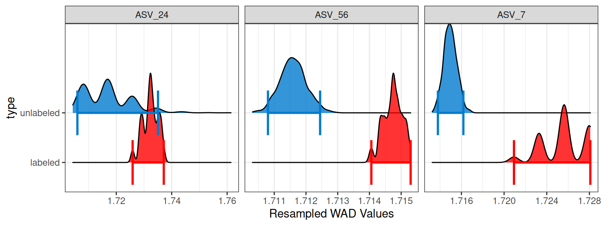
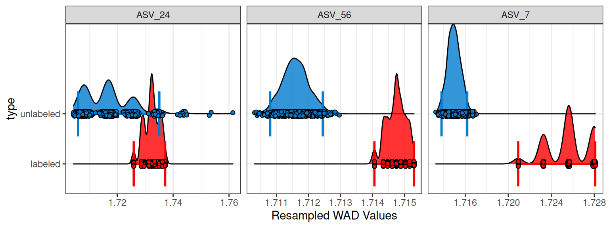
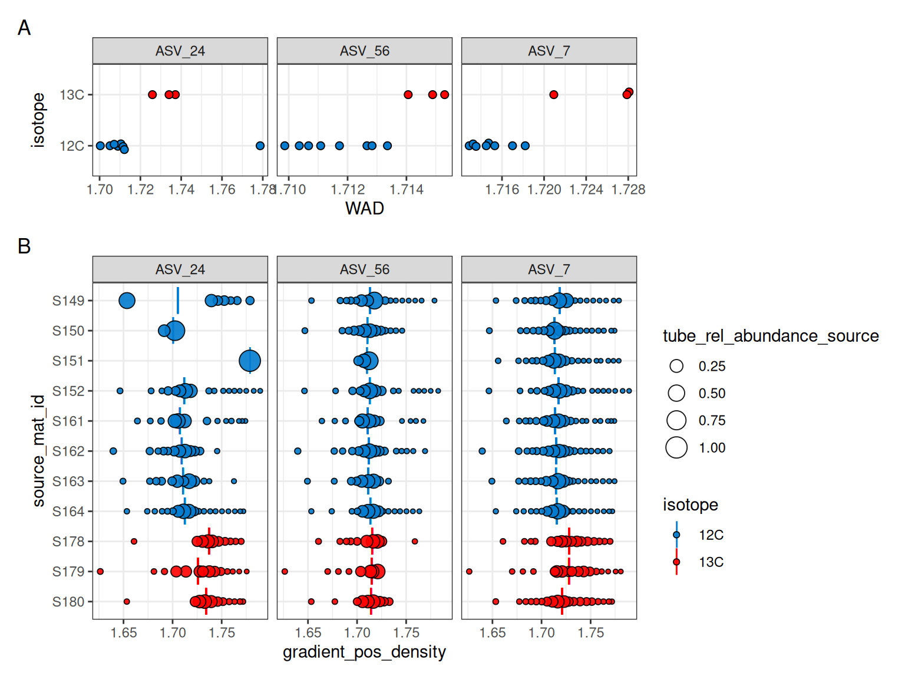
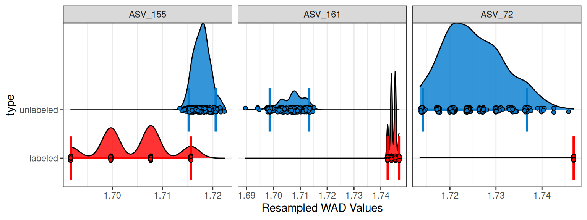
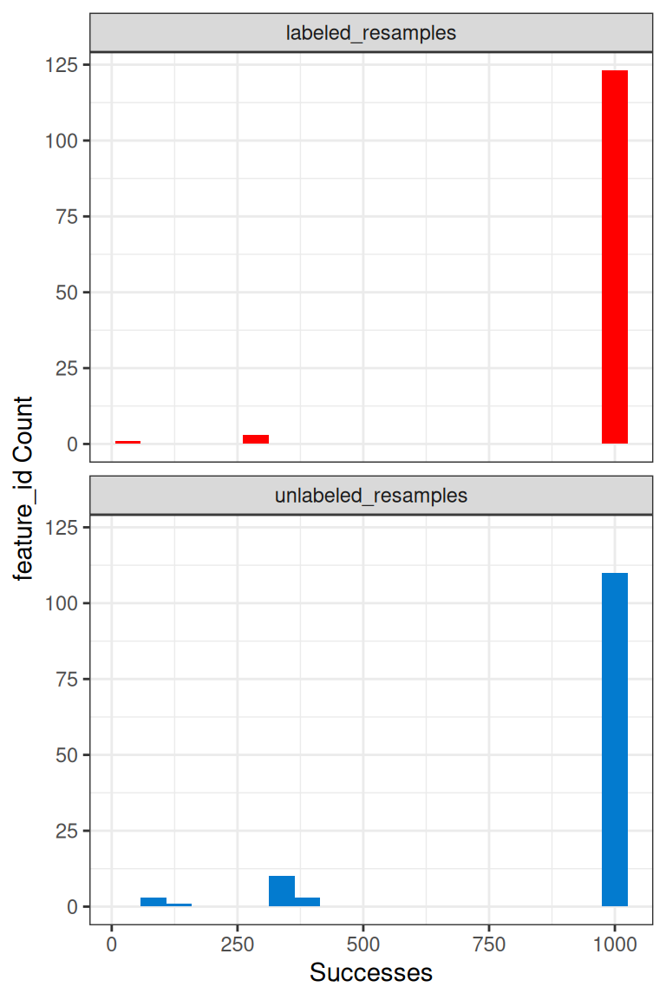
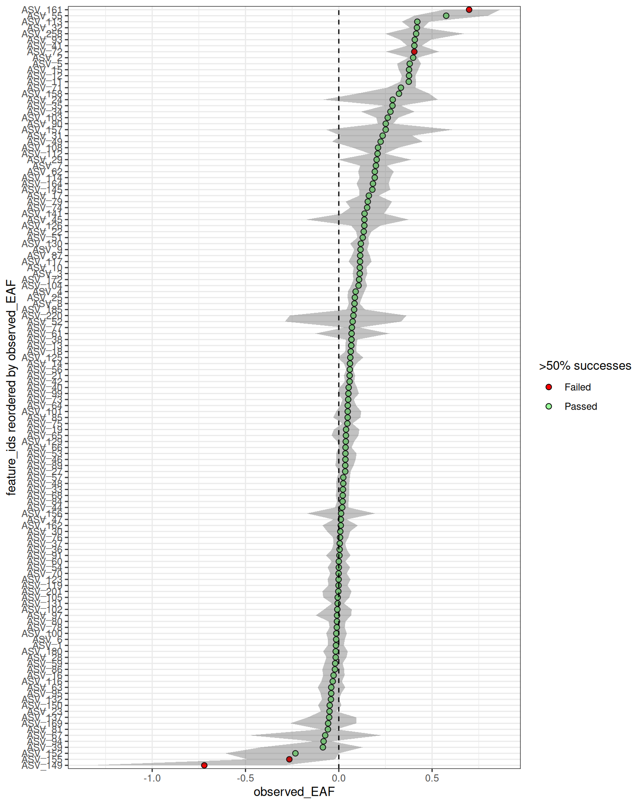

# Resampling

``` r
library(dplyr)
library(purrr)
library(tidyr)
library(ggplot2)
library(patchwork)
library(qSIP2)
packageVersion("qSIP2")
#> [1] '0.23.4'
```

## Background

In `qSIP2`, we use *resampling* of weighted average densities (WADs) to
estimate confidence intervals both *within* replicate groups (unlabeled
vs. labeled) and for the shift in mean WADs *between* these groups. This
is done using a simple bootstrap procedure, where the source WADs for
each `feature_id` are repeatedly sampled with replacement \\n\\ times.

## Resampling in R

Let’s assume a WAD dataset of 4 sources labeled *A*–*D*.

``` r
WADs <- c(A = 1.679, B = 1.691, C = 1.692, D = 1.703)
```

To generate a bootstrap replicate, we sample these values **with
replacement** until we obtain a new sample of the same size. Because
sampling is done with replacement, some values may be selected more than
once, while others may not be selected at all.

For example, a single bootstrap replicate might look like this:

| draw_1 | draw_2 | draw_3 | draw_4 |
|:-------|:-------|:-------|:-------|
| B      | D      | A      | B      |

Table 1: An single example of bootstrap draws where B is drawn twice,
and C is not drawn at all.

We can repeat this process \\n\\ times to generate multiple bootstrap
replicates:

| bootstrap | draw_1 | draw_2 | draw_3 | draw_4 |
|----------:|:-------|:-------|:-------|:-------|
|         1 | A      | C      | B      | B      |
|         2 | A      | B      | A      | A      |
|         3 | C      | A      | D      | C      |
|         4 | D      | B      | A      | D      |
|         5 | D      | A      | A      | C      |

Table 2: An example of 5 resamplings of A-D

Each row represents one bootstrap replicate, and each column
(`draw_1`–`draw_4`) corresponds to a draw from the original data. This
format makes it clear that resampling is simply repeated random sampling
with replacement, where duplicates can occur naturally.

## qSIP2 resampling

The `qSIP2` package has a function called
[`run_resampling()`](https://jeffkimbrel.github.io/qSIP2/reference/run_resampling.md)
that will perform the resampling procedure on a filtered `qSIP_data`
object. This object must first be filtered with the
[`run_feature_filter()`](https://jeffkimbrel.github.io/qSIP2/reference/run_feature_filter.md)
function, and we’ll come back to how this filtering affects the
resampling in a bit.

``` r
q <- run_feature_filter(example_qsip_object,
  unlabeled_source_mat_ids = get_all_by_isotope(example_qsip_object, "12C"),
  labeled_source_mat_ids = c("S178", "S179", "S180"),
  min_unlabeled_sources = 3,
  min_labeled_sources = 3,
  min_unlabeled_fractions = 6,
  min_labeled_fractions = 6,
  quiet = TRUE # running with quiet = TRUE to suppress messages
) 

q <- run_resampling(q,
  resamples = 1000,
  with_seed = 19,
  progress = FALSE
)
#> Warning: 7 unlabeled and 0 labeled feature_ids had resampling failures.
#> ℹ Run `get_resample_counts()` or `plot_successful_resamples()` on your
#>   <qsip_data> object to inspect.
```

Setting `resamples = 1000` will give 1000 resamplings for each feature.
The resampling is not a deterministic procedure, and so the use of a
seed is recommended using the `with_seed` argument.

### Under the hood

Internally, the `qSIP2` code has a function that is called that makes
the resampling output a bit more tidy. It does this by removing the
original names and prepending them with the *type*. So, if the data was
the “labeled” type, then resampled values will be in columns
*labeled_1*, *labeled_2*, etc. It will also keep the data tidy by adding
additional columns that are useful.

| feature_id | type    | resample | labeled_1 | labeled_2 | labeled_3 | labeled_4 |
|:-----------|:--------|---------:|----------:|----------:|----------:|----------:|
| 1          | labeled |        1 |     1.692 |     1.692 |     1.692 |     1.679 |
| 1          | labeled |        2 |     1.692 |     1.692 |     1.691 |     1.692 |
| 1          | labeled |        3 |     1.692 |     1.679 |     1.692 |     1.691 |
| 1          | labeled |        4 |     1.691 |     1.692 |     1.692 |     1.691 |
| 1          | labeled |        5 |     1.691 |     1.691 |     1.692 |     1.691 |

Table 3: The labeled and unlabeled WAD values for each feature under go
separate resamplings

**Note:** Each resampling produces a different set of draws, but within
a given resample the same draws are applied to all features. For
example, if resample \#1 yields `A A C D`, those same WAD values are
used for every feature in that resample. This behavior can have
consequences, discussed below.

## Inspect resample results

The resampling results are stored in the `qSIP_data` object in the
`@resamples` slot, but they are not necessarily intended to be worked
with directly. Instead, the `qSIP_data` object has helper functions like
[`n_resamples()`](https://jeffkimbrel.github.io/qSIP2/reference/n_resamples.md)
and
[`resample_seed()`](https://jeffkimbrel.github.io/qSIP2/reference/resample_seed.md)
that will return the number of resamples that were performed and the
seed that was used, respectively.

``` r
n_resamples(q)
#> [1] 1000
resample_seed(q)
#> [1] 19
```

If you want the data itself, you can access it with the
[`get_resample_data()`](https://jeffkimbrel.github.io/qSIP2/reference/get_resample_data.md)
function and appropriate arguments ([Table 4](#tbl-get_resample_data)).
Note, if you set `pivot = TRUE` the dataframe can be quite large and
take a while to assemble/display.

``` r
resamples = get_resample_data(q, type = "unlabeled")
```

| feature_id | resample | unlabeled_1 | unlabeled_2 | unlabeled_3 | unlabeled_4 | unlabeled_5 | unlabeled_6 | unlabeled_7 | unlabeled_8 |
|:-----------|---------:|------------:|------------:|------------:|------------:|------------:|------------:|------------:|------------:|
| ASV_1      |        1 |    1.704913 |    1.703887 |    1.708744 |    1.702578 |    1.708744 |    1.704913 |    1.701500 |    1.702578 |
| ASV_10     |        1 |    1.714360 |    1.711404 |    1.713880 |    1.715351 |    1.713880 |    1.714360 |    1.712782 |    1.715351 |
| ASV_104    |        1 |    1.714244 |    1.711037 |    1.711665 |    1.714251 |    1.711665 |    1.714244 |    1.712884 |    1.714251 |
| ASV_108    |        1 |    1.715645 |    1.710424 |    1.722659 |    1.715585 |    1.722659 |    1.715645 |    1.707078 |    1.715585 |
| ASV_11     |        1 |    1.717086 |    1.713310 |    1.714547 |    1.717568 |    1.714547 |    1.717086 |    1.714165 |    1.717568 |
| ASV_112    |        1 |    1.712588 |    1.709385 |    1.710770 |    1.712681 |    1.710770 |    1.712588 |    1.707287 |    1.712681 |

Table 4: The first few lines of the unlabeled resampling results. There
were 8 draws because there were 8 unlabeled sources used in the
filtering.

### Visualizing range of mean resampled WADs

Rather than seeing all of the resampled data itself, you are often only
interested in the range of the mean WAD values for each resampling
iteration. You can leave the `feature_id` argument empty to see all of
the features, or you can specify a single feature or a vector of
features. Here, I will select 3 random feature_ids to show.

``` r
set.seed(52)
random_features <- sample(get_feature_ids(q, filtered = T), 3)
plot_feature_resamplings(q, 
                         feature_id = random_features,
                         interval = "bar",
                         confidence = 0.95)
```



Figure 1: Feature resampling results of 3 random features plotted with
plot_feature_resamplings()

### Why bootstrap distributions can appear “spiky”

When the number of observations is small, bootstrap resampling can only
produce a limited set of possible values. In our case, each bootstrap
replicate is formed by sampling **3 values with replacement** and then
taking their mean. Because the sample size is so small, many bootstrap
replicates end up reusing the same values in different combinations. If
one of the original values is more extreme than the others, this effect
becomes more pronounced.

For example, consider three values:

    1, 1, 10

When sampling 3 values with replacement, there are only a few distinct
combinations (ignoring order):

- (1, 1, 1) → mean = 1  
- (1, 1, 10) → mean = 4  
- (1, 10, 10) → mean = 7  
- (10, 10, 10) → mean = 10

Even if we generate 1,000 bootstrap replicates, the means can only take
on these few values (see the points in
**?@fig-plot_feature_resamplings2**). As a result, the distribution of
bootstrap means is not smooth, but instead shows **discrete spikes** at
these values.

This same behavior appears in the WAD data. Each feature in
[Table 5](#tbl-wad_values) has only three observed values:

| feature_id |     S179 |     S180 |     S178 |
|:-----------|---------:|---------:|---------:|
| ASV_56     | 1.714890 | 1.714060 | 1.715299 |
| ASV_24     | 1.725895 | 1.734049 | 1.737135 |
| ASV_7      | 1.727877 | 1.720926 | 1.728086 |

Table 5: Actual WAD values for the three ASVs

Because bootstrap replicates are built from just these three values, the
resulting means can only take on a limited set of possibilities. When
plotted as a histogram with `points = TRUE`, this leads to the “spiky”
appearance where the resampled values stack in more discrete locations
rather than smoothly. Each point is mean WAD value for one of the 1000
successful resamplings.

``` r
plot_feature_resamplings(q, 
                         feature_id = random_features,
                         interval = "bar",
                         confidence = 0.95,
                         points = TRUE)
#> Scale for fill is already present.
#> Adding another scale for fill, which will replace the existing scale.
```



Figure 2: Feature resampling results of 3 random features with 95% CI,
with points = TRUE

In general, this effect diminishes as the number of observations
increases: with more values, there are many more possible resampled
combinations, and the bootstrap distribution becomes smoother. Just to
further drive it home, **?@fig-plot_feature_resamplings2** shows some
spikiness for ASV_24, even in the blue unlabeled histogram with 8 values
used in the bootstrapping. If we make a plot of the WAD values used for
bootstrapping, we can see an outlier in that one feature
([Figure 3](#fig-geom_beeswarm)), and that one outlier is enough to
introduce spikiness in the histogram. The benefits of the bootstrapping
are also apparent here because although that outlier is up near a
density of 1.78 g/mL, none of the mean WAD values approach that high,
unrealistic value.



Figure 3: Feature resampling results of 3 random features with 95% CI

The outlier here is from source S151 ([Figure 3](#fig-geom_beeswarm)),
in which ASV_24 is found in only one fraction. This brings up an
important point that although in the filtering we required a feature to
be found in at least 6 fractions in at least 3 source_mat_ids, the data
is still used from all sources if a feature passes. So, although ASV_24
was not found in 6 fractions in S150 and S151, and ASV_56 also didn’t
have enough fractions in S151, the WAD values for these cases are still
used because these overall these features passed the filtering criteria.

## When resampling goes wrong

The resampling procedure is a simple bootstrap procedure, and so it is
not without its limitations. The most common issue is when there are
more sources than your filtering requires, and you end up with WADs that
contain `NA` values.

Take ASV_72 as an example, it is found in only 1 of the labeled sources
(S178) above the fraction threshold, so it was removed from the previous
filtering step. But, if your filtering requirements were less strict as
before (e.g. by setting `min_labeled_sources = 1`), then this feature
could make it through the filtering.

``` r
q2 <- run_feature_filter(example_qsip_object,
  unlabeled_source_mat_ids = get_all_by_isotope(example_qsip_object, "12C"),
  labeled_source_mat_ids = c("S178", "S179", "S180"),
  min_unlabeled_sources = 3,
  min_labeled_sources = 1,
  min_unlabeled_fractions = 6,
  min_labeled_fractions = 6,
  quiet = TRUE
) # running with quiet = TRUE to suppress messages
```

| feature_id | source_mat_id |      WAD | n_fractions |
|:-----------|:--------------|---------:|------------:|
| ASV_72     | S150          | 1.713317 |           1 |
| ASV_72     | S152          | 1.764545 |           4 |
| ASV_72     | S149          | 1.741933 |           5 |
| ASV_72     | S178          | 1.746895 |           6 |
| ASV_72     | S161          | 1.713579 |          14 |
| ASV_72     | S162          | 1.713647 |          18 |
| ASV_72     | S163          | 1.713918 |          19 |
| ASV_72     | S164          | 1.714959 |          19 |

But we now get an error when running the resampling step suggesting we
increase our filtering stringency.

``` r
run_resampling(q2,
  resamples = 1000,
  with_seed = 19,
  progress = FALSE
)
#> Error in `purrr::map()`:
#> ℹ In index: 10.
#> Caused by error in `calculate_resampled_wads()`:
#> ! Something went wrong with resampling.
#> ℹ It is possible that some resampled features contained only "NA" WAD values,
#>   leading to a failure in `calculate_Z()`.
#> → Try increasing your filtering stringency to remove features not found in most
#>   sources.
#> → Or, trying running with `allow_failures = TRUE`
```

#### Handling missing values during bootstrap resampling

Bootstrap resampling in `qSIP2` is performed at the level of samples
(i.e., columns). For each bootstrap replicate, a set of columns is
sampled with replacement, and this same set of sampled columns is
applied to all features. In this way, each bootstrap replicate
represents a resampled version of the original experiment.

Because the same sampled columns are used for all features, missing
values (`NA`/`NaN`) are carried along in the resampling. For example,
consider *ASV_72*, which has three potential source values but only one
observed (non-missing) value. The remaining sources (S179 and S180) are
included in the resampling but have values of `NaN`.

In this case, bootstrap replicates frequently include one or more `NaN`
values. When all sampled values for a replicate are `NaN`, the mean is
undefined for that feature and replicate. Rather than modifying the
sampled columns on a feature-by-feature basis (e.g., by dropping columns
with missing values), we retain the original resampling scheme and
record the result as `NA`.

This behavior is expected: bootstrapping a vector that is largely `NaN`
will often produce undefined results because the effective information
for that feature is very limited. Importantly, we do not alter the
sampled columns within individual features, as doing so would break the
shared resampling structure across features and make bootstrap
replicates no longer directly comparable.

As a result, features with many missing values (such as *ASV_72*) may
contribute fewer valid bootstrap replicates. Summary statistics (e.g.,
confidence intervals) are therefore computed using only the valid
(non-missing) bootstrap results for each feature. In practice, filtering
features to require a minimum number of observed sources (e.g., via
`min_labeled_sources`) can reduce the prevalence of `NaN` values
entering the resampling procedure and improve stability.

### Allow failures

Although increasing the stringency can remove the error, it will also
remove features from the dataset. If you want to keep the features
(e.g. you didn’t want *ASV_72* removed), you can set
`allow_failures = TRUE` in the
[`run_resampling()`](https://jeffkimbrel.github.io/qSIP2/reference/run_resampling.md)
function. This will allow the resampling to continue, but it will also
return a warning message that the resampling failed for some iterations
of some features.

``` r
q2 <- run_resampling(q2,
  resamples = 1000,
  with_seed = 19,
  allow_failures = TRUE,
  progress = FALSE
)
#> Warning: 17 unlabeled and 4 labeled feature_ids had resampling failures.
#> ℹ Run `get_resample_counts()` or `plot_successful_resamples()` on your
#>   <qsip_data> object to inspect.
```

The warning message here lets us know that there were no problems with
the unlabeled resampling, but several features had failures for the
labeled sources. We can see which features had failures by
[`get_resample_counts()`](https://jeffkimbrel.github.io/qSIP2/reference/get_resample_counts.md)
and filtering for values of \\n\\ less than 1000 (our number of
resamples).

``` r
get_resample_counts(q2) |> 
  filter(labeled_resamples < 1000 | unlabeled_resamples < 1000)
#> # A tibble: 17 × 3
#>    feature_id labeled_resamples unlabeled_resamples
#>    <chr>                  <int>               <int>
#>  1 ASV_113                 1000                 334
#>  2 ASV_117                 1000                 345
#>  3 ASV_126                 1000                 345
#>  4 ASV_130                 1000                 334
#>  5 ASV_149                  292                 123
#>  6 ASV_155                  307                 345
#>  7 ASV_157                 1000                 100
#>  8 ASV_161                  292                 364
#>  9 ASV_162                 1000                 323
#> 10 ASV_220                 1000                 100
#> 11 ASV_34                  1000                 364
#> 12 ASV_45                  1000                 100
#> 13 ASV_49                  1000                 364
#> 14 ASV_52                  1000                 334
#> 15 ASV_61                  1000                 334
#> 16 ASV_72                    32                 345
#> 17 ASV_74                  1000                 345
```

Here, we see that indeed ASV_72 was only successful in 32 and 345 of
1000 resamplings for the labeled and unlabeled, respectively.
Statistically, you may conclude that 32 resamplings is still robust
enough to accept the conclusion. But inspecting the plot for these 3 of
these features show something strange with ASV_72 and we may still
choose to remove it from our analysis.

``` r
plot_feature_resamplings(q2, 
                         feature_id = c("ASV_72", "ASV_155", "ASV_161"), 
                         intervals = "bar",
                         points = TRUE)
#> Scale for fill is already present.
#> Adding another scale for fill, which will replace the existing scale.
```



We can further see the resampling successes for each feature with the
[`plot_successful_resamples()`](https://jeffkimbrel.github.io/qSIP2/reference/plot_successful_resamples.md)
function, and this histogram shows that most features do have 1000
successful resamplings.

``` r
plot_successful_resamples(q2)
```



### Using success results for further filtering

Suppose you want to overlay this success data on your final EAF plot so
you can decide you have enough resampling support to trust the EAF value
you obtain. This is easy to do, and you can modify the point color based
on passing a threshold. We will use a success rate of 90% (i.e. 900 of
1000 resamples) as our threshold here.

Here, we can see that although most are green, ASV_72 does show up as
highly enriched and with a confidence interval clear of 0. But, the red
dot further flags it as suspect and warrants a deeper look.

``` r
EAF = run_EAF_calculations(q2)

plot_EAF_values(EAF, 
                error = "ribbon",
                confidence = 0.95,
                success_ratio = 0.5)
#> Confidence level = 0.95
```



## Conclusion

In conclusion, instead of pre-filtering your data based on the number of
sources or fractions, you can use the resampling procedure to determine
if your data is robust enough to proceed. This is especially useful when
you have a large dataset and you want to ensure that you are not
removing features that could be informative.
